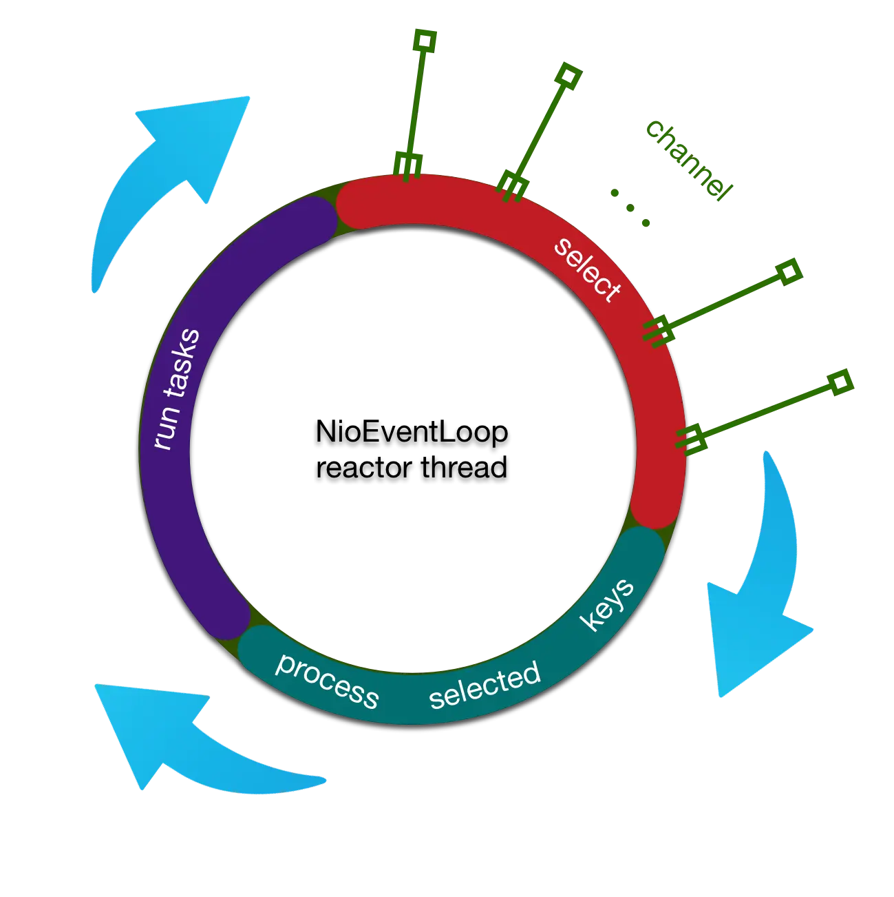
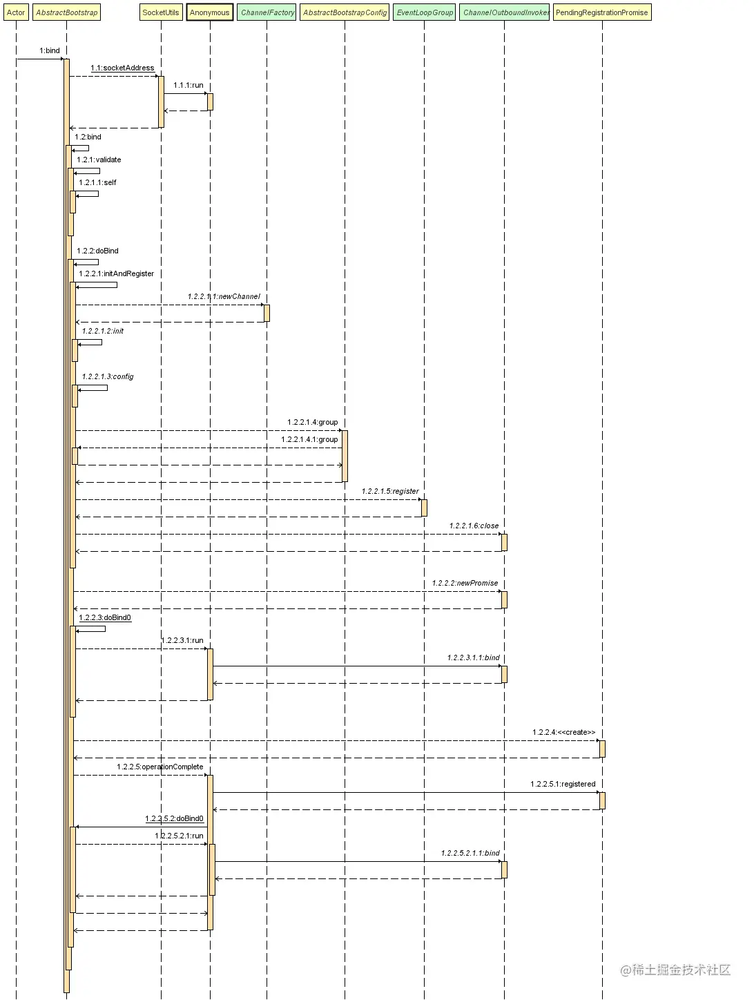

# Netty源码

> 版本：​`4.1.97.Final`​

# Reactor现场模型

​

​

## reactor 线程的启动

### NioEventLoop

NioEventLoop中维护了一个线程，线程启动时会调用NioEventLoop的run方法，执行I/O任务和非I/O任务。

* **I/O任务：** 指的是accept、connect、read、write等
* **非I/O任务：** 添加到taskQueue中的任务，如register0，bind0等任务

‍

> 父类 SingleThreadEventExecutor 的execute方法

```java
//外部线程在往任务队列里面添加任务的时候执行 startThread() ，netty会判断reactor线程有没有被启动，如果没有被启动，那就启动线程
private void execute(Runnable task, boolean immediate) {
        boolean inEventLoop = inEventLoop();
        addTask(task);
        if (!inEventLoop) {
		
            startThread();
            if (isShutdown()) {
                boolean reject = false;
                try {
                    if (removeTask(task)) {
                        reject = true;
                    }
                } catch (UnsupportedOperationException e) {
                    // The task queue does not support removal so the best thing we can do is to just move on and
                    // hope we will be able to pick-up the task before its completely terminated.
                    // In worst case we will log on termination.
                }
                if (reject) {
                    reject();
                }
            }
        }

        if (!addTaskWakesUp && immediate) {
            wakeup(inEventLoop);
        }
    }

```

### Selector优化

> Selector返回的是`SelectorTuple`​，此类是一个包装类，对Selector进行了包装，JDK NIO的SelectionKeySet是用HashSet存储的，HashSet底层使用的HashMap，put的时间复杂度为O(logn)，Netty使用数组对存储方式进行了改变，数组add操作的时间复杂度降为O(1)，可以看到Netty的优化是非常细节的，并且通过自定义的`SelectedSelectionKeySetSelector`​对其进行了组合封装。

```java
private SelectorTuple openSelector() {
        final Selector unwrappedSelector;
        try {
            unwrappedSelector = provider.openSelector();
        } catch (IOException e) {
            throw new ChannelException("failed to open a new selector", e);
        }
		/**
     	* 判断是否关闭SelectionKeySet优化，默认是false，不关闭
     	*/
        if (DISABLE_KEY_SET_OPTIMIZATION) {
            return new SelectorTuple(unwrappedSelector);
        }
		/**
        * 创建class sun.nio.ch.SelectorImpl字节码
        */
        Object maybeSelectorImplClass = AccessController.doPrivileged(new PrivilegedAction<Object>() {
            @Override
            public Object run() {
                try {
                    return Class.forName(
                            "sun.nio.ch.SelectorImpl",
                            false,
                            PlatformDependent.getSystemClassLoader());
                } catch (Throwable cause) {
                    return cause;
                }
            }
        });

        if (!(maybeSelectorImplClass instanceof Class) ||
            // ensure the current selector implementation is what we can instrument.
            !((Class<?>) maybeSelectorImplClass).isAssignableFrom(unwrappedSelector.getClass())) {
            if (maybeSelectorImplClass instanceof Throwable) {
                Throwable t = (Throwable) maybeSelectorImplClass;
                logger.trace("failed to instrument a special java.util.Set into: {}", unwrappedSelector, t);
            }
			//如果获取SelectorImpl字节码失败,则返回一个SelectorTuple未包装的原生selector
            return new SelectorTuple(unwrappedSelector);
        }
	    /**
	     * Netty对SelectionKeySet的优化，SelectedSelectionKeySet基于数组实现
	     */
	    final Class<?> selectorImplClass = (Class<?>) maybeSelectorImplClass;
        final SelectedSelectionKeySet selectedKeySet = new SelectedSelectionKeySet();

        Object maybeException = AccessController.doPrivileged(new PrivilegedAction<Object>() {
            @Override
            public Object run() {
                try {
                /**
                 * 通过反射替换Selector的成员变量selectedKeys(Set)为Netty优化后的数组实现{@link SelectedSelectionKeySet}
                 * 使用数组实现，add操作的时间复杂度降为O(1)，而Set底层使用的HashMap，put的时间复杂度为O(logn)，这也是Netty的一个优化点
                 */
                    Field selectedKeysField = selectorImplClass.getDeclaredField("selectedKeys");
                    Field publicSelectedKeysField = selectorImplClass.getDeclaredField("publicSelectedKeys");

                    if (PlatformDependent.javaVersion() >= 9 && PlatformDependent.hasUnsafe()) {
                        // Let us try to use sun.misc.Unsafe to replace the SelectionKeySet.
                        // This allows us to also do this in Java9+ without any extra flags.
                        long selectedKeysFieldOffset = PlatformDependent.objectFieldOffset(selectedKeysField);
                        long publicSelectedKeysFieldOffset =
                                PlatformDependent.objectFieldOffset(publicSelectedKeysField);

                        if (selectedKeysFieldOffset != -1 && publicSelectedKeysFieldOffset != -1) {
                            PlatformDependent.putObject(
                                    unwrappedSelector, selectedKeysFieldOffset, selectedKeySet);
                            PlatformDependent.putObject(
                                    unwrappedSelector, publicSelectedKeysFieldOffset, selectedKeySet);
                            return null;
                        }
                        // We could not retrieve the offset, lets try reflection as last-resort.
                    }
                    //设置两个字段可访问
                    Throwable cause = ReflectionUtil.trySetAccessible(selectedKeysField, true);
                    if (cause != null) {
                        return cause;
                    }
                    cause = ReflectionUtil.trySetAccessible(publicSelectedKeysField, true);
                    if (cause != null) {
                        return cause;
                    }
                	/**
                    * 将Selector的SelectionKeySet替换为Netty自己的
                    */
                    selectedKeysField.set(unwrappedSelector, selectedKeySet);
                    publicSelectedKeysField.set(unwrappedSelector, selectedKeySet);
                    return null;
                } catch (NoSuchFieldException e) {
                    return e;
                } catch (IllegalAccessException e) {
                    return e;
                }
            }
        });

        if (maybeException instanceof Exception) {
            selectedKeys = null;
            Exception e = (Exception) maybeException;
            logger.trace("failed to instrument a special java.util.Set into: {}", unwrappedSelector, e);
            return new SelectorTuple(unwrappedSelector);
        }
        selectedKeys = selectedKeySet;
        logger.trace("instrumented a special java.util.Set into: {}", unwrappedSelector);
        return new SelectorTuple(unwrappedSelector,
                                 new SelectedSelectionKeySetSelector(unwrappedSelector, selectedKeySet));
    }
```

### run方法，执行任务

```java
   @Override
    protected void run() {
        int selectCnt = 0;
        for (;;) {
            try {
                int strategy;
                try {
                    strategy = selectStrategy.calculateStrategy(selectNowSupplier, hasTasks());
                    switch (strategy) {
                    case SelectStrategy.CONTINUE:
                        continue;

                    case SelectStrategy.BUSY_WAIT:
                        // fall-through to SELECT since the busy-wait is not supported with NIO

                    case SelectStrategy.SELECT:
						//当没有普通任务时，返回定时任务最近一次要执行的时间，如果有没有定时任务则返回-1
                        long curDeadlineNanos = nextScheduledTaskDeadlineNanos();
                        if (curDeadlineNanos == -1L) {
                            curDeadlineNanos = NONE; // nothing on the calendar
                        }
                        nextWakeupNanos.set(curDeadlineNanos);
                        try {
                            if (!hasTasks()) {
								//select看是否有新增的感兴趣的事件
                                strategy = select(curDeadlineNanos);
                            }
                        } finally {
                            // This update is just to help block unnecessary selector wakeups
                            // so use of lazySet is ok (no race condition)
   							//延迟设置线程的唤醒时间阻塞不必要的Select唤醒
                            nextWakeupNanos.lazySet(AWAKE);
                        }
                        // fall through
                    default:
                    }
                } catch (IOException e) {
                    // If we receive an IOException here its because the Selector is messed up. Let's rebuild
                    // the selector and retry. https://github.com/netty/netty/issues/8566
					//重建Selector
                    rebuildSelector0();
					//重置计数
                    selectCnt = 0;
                    handleLoopException(e);
                    continue;
                }

                selectCnt++;
                cancelledKeys = 0;
                needsToSelectAgain = false;
                final int ioRatio = this.ioRatio;
                boolean ranTasks;
                if (ioRatio == 100) {
                    try {
                        if (strategy > 0) {
							//如果有新增的感兴趣的事件，则处理
                            processSelectedKeys();
                        }
                    } finally {
                        // Ensure we always run tasks.
						//所有的时间都用来处理IO事件，包括普通任务和定时任务，不限制时间
                        ranTasks = runAllTasks();
                    }
                } else if (strategy > 0) {
					//记录当前时间
                    final long ioStartTime = System.nanoTime();
                    try {
						//处理Channel的就绪事件
                        processSelectedKeys();
                    } finally {
                        // Ensure we always run tasks.
                        //计算用来处理IO事件的时间，包括普通任务和定时任务，限制时间
                        //以处理Channel的就绪事件所需时间为基准计算执行所有任务需要的时间
                        final long ioTime = System.nanoTime() - ioStartTime;
                        ranTasks = runAllTasks(ioTime * (100 - ioRatio) / ioRatio);
                    }
                } else {
                    ranTasks = runAllTasks(0); // This will run the minimum number of tasks
                }
				//如果有任务执行过了或者有任务待执行，则重置select计数
                if (ranTasks || strategy > 0) {
                    if (selectCnt > MIN_PREMATURE_SELECTOR_RETURNS && logger.isDebugEnabled()) {
                        logger.debug("Selector.select() returned prematurely {} times in a row for Selector {}.",
                                selectCnt - 1, selector);
                    }
					//有新增的事件，或者任务执行过，则将空轮询次数置0
                    selectCnt = 0;
                } else if (unexpectedSelectorWakeup(selectCnt)) { // Unexpected wakeup (unusual case)
					//针对意外唤醒，重置计数
                    selectCnt = 0;
                }
            } catch (CancelledKeyException e) {
                // Harmless exception - log anyway
                if (logger.isDebugEnabled()) {
                    logger.debug(CancelledKeyException.class.getSimpleName() + " raised by a Selector {} - JDK bug?",
                            selector, e);
                }
            } catch (Error e) {
                throw e;
            } catch (Throwable t) {
                handleLoopException(t);
            } finally {
                // Always handle shutdown even if the loop processing threw an exception.
                try {
                    if (isShuttingDown()) {
                   		//如果EventLoop状态是正在关闭、已关闭、已终止，则执行关闭逻辑，关闭Channel和Selector的绑定，关闭Channel
                        closeAll();
						//确认是否可以关闭了
                        if (confirmShutdown()) {
							//退出NioEventLoop线程循环
                            return;
                        }
                    }
                } catch (Error e) {
                    throw e;
                } catch (Throwable t) {
                    handleLoopException(t);
                }
            }
        }
    }

```

整个`run`​方法的执行流程如下：判断是否有任务需要执行（taskQueue + 定时任务）或者有感兴趣的事件

1. 有新增的感兴趣的事件则先处理事件
2. 有任务需要执行则先执行任务
3. 判断是否要shutDown

在服务端刚刚启动时，感兴趣的事件肯定是客户端的连接(ACCEPT)时间，那这个感兴趣的事件是在Channel注册后最终会调用`AbstractNioChannel#doBeginRead`​​到方法，此处就会将感兴趣的事件设置为OP_ACCEPT。

#### IO任务处理时间比例和事件比例控制：ioRatio，strategy

```java
if (ioRatio == 100) {
    try {
        if (strategy > 0) {
			//处理感兴趣的事情（）
            processSelectedKeys(ACCEPT 事件);
        }
    } finally {
        // Ensure we always run tasks.
		//所有的时间都用来处理IO事件，包括普通任务和定时任务，不限制时间
        ranTasks = runAllTasks();
    }
} else if (strategy > 0) {//如果有新增的感兴趣的事件
    //记录当前时间
    final long ioStartTime = System.nanoTime();
    try {
       //处理Channel的就绪事件
        processSelectedKeys();
    } finally {
        // Ensure we always run tasks.
        //计算用来处理IO事件的时间，包括普通任务和定时任务，限制时间
        //以处理Channel的就绪事件所花时间为基准计算执行所有任务需要的时间
        final long ioTime = System.nanoTime() - ioStartTime;
        ranTasks = runAllTasks(ioTime * (100 - ioRatio) / ioRatio);
    }
} else {
	//如果没有新增的感兴趣的事件，则执行所有的任务
    ranTasks = runAllTasks(0); // This will run the minimum number of tasks
}
```

* ioRatio等于100时，则不会对执行任务限制时间，如果有新增的感兴趣的时间，则全力处理感兴趣的事件，如果有待执行的任务，则全力执行任务
* ioRatio小于100时

  * 当有新增的感兴趣的事件，则先处理感兴趣的事件，处理完事件后，通过处理事件所花的时间计算执行所有的任务最大的时间
  * 当没有新增的感兴趣的事件，则执行所有的任务，这里参为0，表示执行最少的任务

#### 处理新增感兴趣事件

```java
private void processSelectedKeys() {
    //判断是否使用的优化过的SelectionKey
    if (selectedKeys != null) {
        processSelectedKeysOptimized();
    } else {
        processSelectedKeysPlain(selector.selectedKeys());
    }
}
```

#### 执行任务队列任务

‍

#### 重建Selector解决JDK空轮询的bug：`rebuildSelector0`​

##### unexpectedSelectorWakeup

```java
/**
 * 针对意外的唤醒，JDK的空轮训BUG，没有事件发生也会立即返回，此方法主要是为了解决这个BUG
 * 如果已经达到了重建Selector的阈值，则会进行重建Selector，返回true，将select计数重置
 */
private boolean unexpectedSelectorWakeup(int selectCnt) {
    if (Thread.interrupted()) {
        //如果线程被打断
        // Thread was interrupted so reset selected keys and break so we not run into a busy loop.
        // As this is most likely a bug in the handler of the user or it's client library we will
        // also log it.
        //
        // See https://github.com/netty/netty/issues/2426
        if (logger.isDebugEnabled()) {
            logger.debug("Selector.select() returned prematurely because " +
                    "Thread.currentThread().interrupt() was called. Use " +
                    "NioEventLoop.shutdownGracefully() to shutdown the NioEventLoop.");
        }
        return true;
    }
    //判断是否达到了重建Selector的阈值
    if (SELECTOR_AUTO_REBUILD_THRESHOLD > 0 &&
            selectCnt >= SELECTOR_AUTO_REBUILD_THRESHOLD) {
        // The selector returned prematurely many times in a row.
        // Rebuild the selector to work around the problem.
        // Selector连续多次提前返回
        logger.warn("Selector.select() returned prematurely {} times in a row; rebuilding Selector {}.",
                selectCnt, selector);
        rebuildSelector();
        return true;
    }
    return false;
}
```

##### rebuildSelector

```java
/**
 * Replaces the current {@link Selector} of this event loop with newly created {@link Selector}s to work
 * around the infamous epoll 100% CPU bug.
 * 重建Selector对象来解决JDK epoll的100% CPU的bug，其实Netty并没有解决JDK NIO这个问题，只是进行了规避
 */
public void rebuildSelector() {
    if (!inEventLoop()) {
        //执行一个事件
        execute(new Runnable() {
            @Override
            public void run() {
                rebuildSelector0();
            }
        });
        return;
    }
    rebuildSelector0();
}
```

##### rebuildSelector0

```java
/**
 * 创建一个新的Selector，将之前注册到老的selector上的Channel重新转移到新的Selector上，并将老的Selector关闭
 */
private void rebuildSelector0() {
    final Selector oldSelector = selector;
    final SelectorTuple newSelectorTuple;

    if (oldSelector == null) {
        return;
    }

    try {
        //创建新的Selector
        newSelectorTuple = openSelector();
    } catch (Exception e) {
        logger.warn("Failed to create a new Selector.", e);
        return;
    }

    // Register all channels to the new Selector.
    int nChannels = 0;
    //遍历所有的SelectionKey，将Channel重新注册到新的Selector上
    for (SelectionKey key: oldSelector.keys()) {
        Object a = key.attachment();
        try {
            if (!key.isValid() || key.channel().keyFor(newSelectorTuple.unwrappedSelector) != null) {
                continue;
            }

            int interestOps = key.interestOps();
            //取消老Key
            key.cancel();
            //将Channel注册到新的Selector
            SelectionKey newKey = key.channel().register(newSelectorTuple.unwrappedSelector, interestOps, a);
            if (a instanceof AbstractNioChannel) {
                // Update SelectionKey
                // 修改Channel的SelectionKey为新的SelectionKy
                ((AbstractNioChannel) a).selectionKey = newKey;
            }
            nChannels ++;
        } catch (Exception e) {
            logger.warn("Failed to re-register a Channel to the new Selector.", e);
            if (a instanceof AbstractNioChannel) {
                AbstractNioChannel ch = (AbstractNioChannel) a;
                ch.unsafe().close(ch.unsafe().voidPromise());
            } else {
                @SuppressWarnings("unchecked")
                NioTask<SelectableChannel> task = (NioTask<SelectableChannel>) a;
                invokeChannelUnregistered(task, key, e);
            }
        }
    }
    //修改NioEventLoop的Selector为新的Selector
    selector = newSelectorTuple.selector;
    unwrappedSelector = newSelectorTuple.unwrappedSelector;

}

```

#### shutDown优雅关闭处理

# 服务端启动流程

​​

# 客户端接入流程

# 解码原理

# ChannelPipeline

# WriteAndFlush

# 对象池

‍
