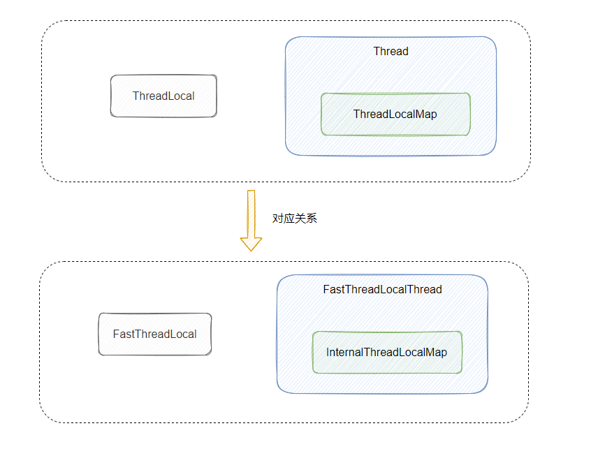

# FastThreadLocal

​

对别

|JDK|Netty|
| ----------------| ------------------------|
|Thread|FastThreadLocalThread|
|ThreadLocal|FastThreadLocal|
|ThreadLocalMap|InternalThreadLocalMap|

区别

|区别|ThreadLocal|FastThreadLocal|
| ----------| ----------------------------------------------------------------------------| -------------------------------------------------------------------------------------------------------------------------------------------------------------------------------------------------------------------------------------------------------------------------------------------------------------------------------------------------------------------------------------------------------------------------------------|
|存储结构|​`Map<WeakReference<ThreadLocal<?>,Object>>`​|​`Object[]`​ 数组下标作为索引， `Object`​ 存储`Value`​|
|内存占用|重复对象可以进行覆盖|每次创建会新建下标，不会利用被删除的位置，数组只会扩容，无法缩容|
|性能|可能产生hash碰撞，线性探测法在解决 Hash 冲突时需要不停地向下寻找，效率较低|定位数据的时候可以直接根据数组下标 index 获取，时间复杂度 O(1)<br />|
|回收|手动调用Remove 进行回收|1.  自动，执行一个被FastThreadLocalRunnable wrap的Runnable任务，在任务执行完毕后会自动进行FastThreadLocal的清理<br />2.  手动，FastThreadLocal和InternalThreadLocalMap都提供了remove方法，在合适的时候用户可以（有的时候也是必须，例如普通线程的线程池使用FastThreadLocal）手动进行调用，进行显示删除<br />3.  自动，为当前线程的每一个FastThreadLocal注册一个Cleaner，当线程对象不强可达的时候，该Cleaner线程会将当前线程的当前ftl进行回收|

Set 集合是为了保存 FastThreadLocal对象，Set 集合设计的好处有几点：

1.  删除 FastThreadLocal 留扩展接口；

2. 提高 removeAll 的删除效率，不需要去遍历膨胀的数组；

3. 可以更好地做内存泄露的管理；

### Remove 操作

```java
    /**
     * Sets the value to uninitialized for the specified thread local map.
     * After this, any subsequent call to get() will trigger a new call to initialValue().
     */
    public final void remove() {
        remove(InternalThreadLocalMap.getIfSet());
    }
    /**
     * Sets the value to uninitialized for the specified thread local map.
     * After this, any subsequent call to get() will trigger a new call to initialValue().
     * The specified thread local map must be for the current thread.
     */
    @SuppressWarnings("unchecked")
    public final void remove(InternalThreadLocalMap threadLocalMap) {
        if (threadLocalMap == null) {
            return;
        }

        Object v = threadLocalMap.removeIndexedVariable(index); //将索引为index的对象重置成Object
        if (v != InternalThreadLocalMap.UNSET) {
            removeFromVariablesToRemove(threadLocalMap, this);// 从数组下标 0 的位置取出 Set 集合，并删除当前 FastThreadLocal
            try {
                onRemoval((V) v);空方法，用户可以继承实现
            } catch (Exception e) {
                PlatformDependent.throwException(e);
            }
        }
    }
```

Q&A

为什么 InternalThreadLocalMap 要在数组下标为 0 的位置存放一个 FastThreadLocal 类型的 Set 集合

* 删除 FastThreadLocal 留扩展接口。
* 提高 removeAll 的删除效率，不需要去遍历膨胀的数组。
* 可以更好地做内存泄露的管理
