# 抓到Netty一个隐藏很深的内存泄露Bug | 详解Recycler对象池的精妙设计与实现

---

* [https://www.jianshu.com/p/442457bfda4e - 简书](https://www.jianshu.com/p/442457bfda4e)
* 本系列Netty源码解析文章基于 4.1.56.Final版本 最近在 Review Netty 代码的时候，不小心用我的肉眼抓到了一个隐藏很深很深的内存泄露Bug。 于是笔...
* 2023-09-24 10:50:49

---

> 本系列Netty源码解析文章基于 **4.1.56.Final**版本

最近在 Review Netty 代码的时候，不小心用我的肉眼抓到了一个隐藏很深很深的内存泄露Bug。

​​

image.png

于是笔者将这个故事....哦不 .....事故，详细的阐述出来分享给大家。

​​

image.png

这将是一篇很长很长的故事，在本文中笔者会详细描述这个内存泄露Bug的发现，分析，修复过程。顺便将对象池在Netty中的一些精妙的设计方案及其源码实现一起详尽地展现给大家。

故事从何说起呢？让我们回到另一个月黑风高天空还是显得那么深邃遥远的夜晚，笔者再一次闲来无事捧起 Netty 对象池相关部分源码细细品读的时候，突然菊花一紧，虎躯一震。意外的用肉眼盯出了一个内存泄露Bug出来。

于是笔者顺手一个Issue，反手一个修复PR提交了过去。

> Issue11864 : [https://github.com/netty/netty/issues/11864](https://links.jianshu.com/go?to=https%3A%2F%2Fgithub.com%2Fnetty%2Fnetty%2Fissues%2F11864)  
> PR : [https://github.com/netty/netty/pull/11865](https://links.jianshu.com/go?to=https%3A%2F%2Fgithub.com%2Fnetty%2Fnetty%2Fpull%2F11865)

​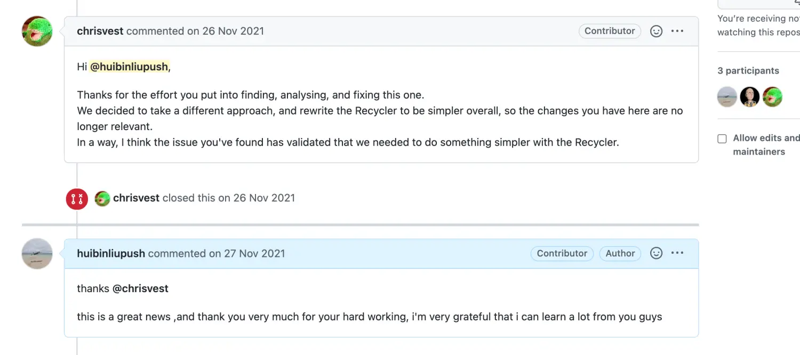​

封面.png

巧合的是Netty也意识到了对象池这块的问题，Netty最近也正在重构这一块，因为Recycler整体设计的还是比较复杂的，这可以从我们接下来要分析的对象池源码实现中可以看的出来，Recycler的复杂性在于它的使用场景混合了并发以及与GC相关的交互，这些相关的问题都比较难以定位，所以Netty决定将对象池这一块用一种更加容易被理解的方式重构掉。

这位说话特别好听的 chrisvest 大佬也说了 我发现的这个Bug也间接证明了Netty要简化对象池设计的正确性和必要性。

​​

asd.jpeg

> 随口提一句，这个大牛 chrisvest 是大名鼎鼎的图数据库 Neo4j 的核心commitor，同时也是Netty Buffer相关API的设计者。

这里先不详细解释这个Issue，也不建议大家现在就打开这个Issue查看，笔者会在本文的介绍中随着源码深入的解读慢慢的为大家一层一层地拨开迷雾。

下面就让我们一起带着怀疑，审视，欣赏，崇敬，敬畏的态度来一起品读世界顶级程序员编写的代码。由衷的感谢他们在这一领域做出的贡献。

​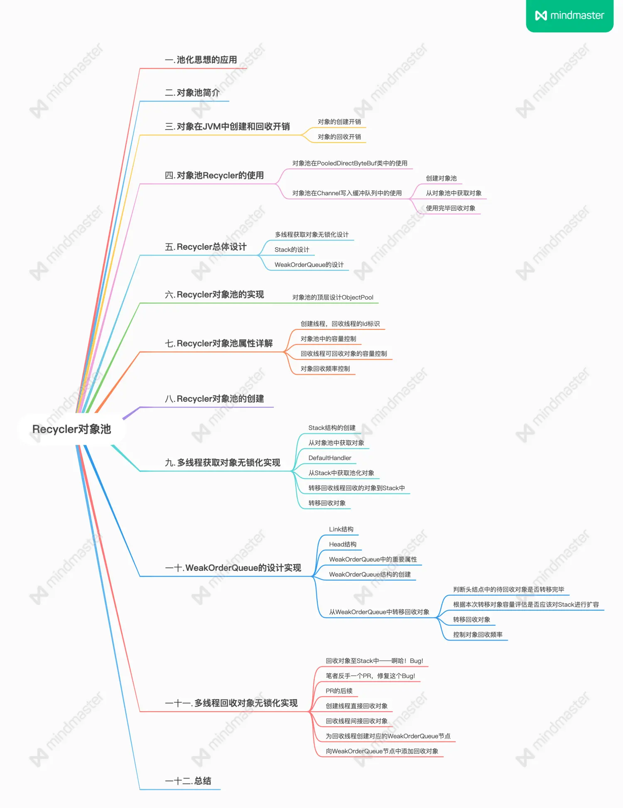​

本文概要.png

## 1. 池化思想的应用

在我们日常开发工作中我们经常会遇到各种池化技术的设计思想，比如连接池，内存池，对象池，还有我们在业务开发过程中经常会缓存一些业务计算结果数据这也同样运用到了池化技术的设计思想，我们可以叫它为结果池。

池化技术的应用场景就是当一个对象的创建和销毁需要付出比较大的性能开销时，我们就需要将这些重量级对象放在一个池子里管理，当需要时直接从池子里获取避免重复创建和销毁的开销从而达到了复用的效果。

比如连接池里面保存管理的都是一些网络连接对象，这些对象创建和销毁的代价比较大。通过连接池将这些重量级的网络连接对象统一管理起来，业务线程可以直接复用，避免了重新创建，释放连接的性能开销以及等待时间。

还有我们在日常开发中遇到的一些计算逻辑复杂的业务，我们通常会先从数据库中查询数据，然后经过复杂的计算得到结果，为了避免下次在重复计算，我们会将计算结果放入缓存中，我们可以称做结果池。也是一种池化思想。

再比如我们在[《Netty如何高效接收网络数据》](https://links.jianshu.com/go?to=https%3A%2F%2Fmp.weixin.qq.com%2Fs%3F__biz%3DMzg2MzU3Mjc3Ng%3D%3D%26mid%3D2247484244%26idx%3D1%26sn%3D831060fc38caa201d69f87305de7f86a%26chksm%3Dce77c513f9004c05b48f849ff99997d6d7252453135ae856a029137b88aa70b8e046013d596e%23rd)一文中提到的内存池，为了避免不必要的数据拷贝以及JVM垃圾回收对性能的影响，Netty 选择使用堆外内存存储网络通信数据。在 Netty 申请堆外内存之前，首先会在 JVM 堆中创建一个用于引用 native memory 的引用对象 DirectByteBuffer ，随后会使用 native 方法 `unsafe.allocateMemory`​ 通过底层 `malloc`​ 系统调用申请一块堆外内存。

这里就涉及到到两个重要开销：

* 在 JVM 堆中创建对象 DirectByteBuffer ，并为该对象申请分配 JVM 堆内存。
* 通过 `malloc`​ 系统调用向操作系统申请堆外内存，然后被 DirectByteBuffer 引用。但是堆外内存的申请和释放远比堆内内存申请和释放的开销要大很多。

而在 Netty 面对的高并发网络通信场景下，申请堆外内存是一个非常频繁的操作，基于以上提到的两个重要性能开销，这种大量频繁的内存申请释放操作对程序的性能影响是巨大的，所以 Netty 就引入了内存池对内存相关的操作进行统一的管理。

## 2. 对象池简介

以上内容的介绍就是池化思想的应用以及它所解决的问题，本文我们的主题是介绍对象池，对象池的引入是为了在需要大量创建对象以及销毁对象的场景下，将对象进行池化以达到复用池中对象，避免大量地重复创建对象以及销毁对象的性能开销，

前边我们在提到内存池的时候说到，在 Netty 所要面对的高并发网络通信场景下，需要大量的申请堆外内存用来存储通信数据。在 Netty 中，我们通过 PooledDirectByteBuf 对象来引用堆外内存。所以 Netty 在处理网络 IO 的时候是需要大量频繁的创建 PooledDirectByteBuf 对象。

为了避免在高并发的场景下大量的创建对象所引来的性能开销，我们可以引入对象池来池化创建出来的 PooledDirectByteBuf 对象，需要用的时候直接从对象池中获取，用完之后在回收到对象池中。

另外这里提前向大家透露一点的是我们下篇文章中即将要介绍的 Netty 发送数据流程涉及到的对象池的应用。我们都知道 Netty 是一个异步事件驱动的高性能网络框架，当在业务线程中处理完业务逻辑准备响应业务结果到客户端的时候，我们会向对应 channel 写入业务结果，此时业务线程会立即返回，这是一个异步的过程。

原因是在底层实现中，Netty 会将用户的响应结果数据暂时写入到每个 Channel 特有的一个发送缓冲队列 ChannelOutboundBuffer 中，也就是说这个 ChannelOutboundBuffer 缓存着 Channel 中的待发送数据。最终会通过 flush 方法，将 ChannelOutboundBuffer 中的这些待发送数据写入到底层 Socket 中，从而发送给客户端。

而这个发送缓冲队列 ChannelOutboundBuffer 中的队列元素是一个 Entry 类型的，每次的写入操作需要创建一个 Entry 对象来包裹发送数据，并将这个 Entry 对象缓存在发送缓冲队列 ChannelOutboundBuffer 中。

> 这里大家只需要知道 ChannelOutboundBuffer 是个啥，它的大概作用，以及这个缓冲队列缓存的对象是 Entry 类型的就可以了，我们会在下篇文章为大家详细介绍，这里引出只是为了介绍对象池的应用场景。

所以Netty在面对海量网络 IO 的场景下，必定会大量频繁地去创建 Entry 对象，那么每一次的网络 IO 都要重新创建这些对象，并且用完又要被垃圾回收掉这样无疑会大量增加 JVM 的负担以及 GC 的时间，这对于最求极致性能的 Netty 来说肯定是不可接受的。

基于以上这几种情况，对象池被用来管理那些需要频繁创建使用的对象，在使用完后并不立即将它们释放，而是将它们在对象池中缓存起来，以供后续的应用程序重复使用，从而减少创建对象和释放对象的开销，进而改善应用程序的性能。

从另一方面来看，对象池还可以将对象限制在一定的数量内从而可以有效减少应用程序在内存上的开销。

---

通过前边关于对象池的简要介绍之后，我想大家现在可能比较好奇这些对象在创建和回收的过程中到底需要哪些开销呢？

接下来笔者就为大家介绍下这些开销方面的内容方便大家更加全面清晰地理解对象池。

## 3. 对象在JVM中创建和回收开销

### 3.1 对象的创建开销

在 Java 程序中我们可以通过一个 new 关键字来创建对象，而当JVM遇到一条 new 的字节码指令后，会发生什么呢？

1. 首先 JVM 要去检查 new 指令后面的参数也就是创建对象所属的 Java 类是否能够在方法区的常量池中定位到类的符号引用，进而检查这个符号引用所代表的类是否已经加载，解析，初始化过。如果没有，就需要先执行类的加载过程。
2. 当通过类加载检查之后，就开始为对象分配内存，而对象所需内存大小其实在类加载完成后就已经确定了。JVM要做的事情就是将一块确定大小的内存区域从JVM堆中划分出来。

> 关于如何确定对象所需内存大小，对这方面细节感兴趣的同学可以回看下笔者的[《对象在JVM中的内存布局》](https://links.jianshu.com/go?to=https%3A%2F%2Fmp.weixin.qq.com%2Fs%3F__biz%3DMzg2MzU3Mjc3Ng%3D%3D%26mid%3D2247484304%26idx%3D1%26sn%3D54bf0d07e69c5621c145afaece8f50d6%26chksm%3Dce77c5d7f9004cc1249a03dfd0fb12b7d75171f1b87acea1fa44bbb11ca374b6f42a66fa274d%23rd)这篇文章。

3. 而在为对象划分堆中内存的时候又会根据JVM堆中内存是否规整，从而分为指针碰撞法和空闲列表法。而多线程同时创建对象在JVM中是非常常见的行为，所以在多线程并发创建对象的时候JVM又需要保证划分内存时的线程安全性。JVM需要对划分内存空间的动作进行同步处理（CAS  + 失败重试）。
4. 而为了避免这种划分内存时的同步锁定，JVM提供了另外一种方式就是每个线程先预先向JVM堆申请一块内存（本地线程分配缓存-TLAB），这样当线程创建对象的时候，先是从自己的TLAB中为对象分配内存，当自己的TLAB用完时，才会去JVM堆中​**同步分配**​。 我们可以通过虚拟机参数`-XX:+UseTLAB`​开启TLAB（默认）。`-XX:-UseTLAB`​关闭TLAB。

> 大家这里需要记住这种利用TLAB的分配方式，因为Netty中的对象池Recycler也是利用这种思想避免多线程获取对象的同步开销。

5. 在为对象分配好内存之后，JVM会将这块内存初始化为零值。这样就可以保证对象中的实例字段不赋初始值就可以直接使用，其值为字段对应数据类型的零值。
6. 设置对象头。包括设置MarkWord中的对象运行时信息。以及通过类型指针引用关联到类的元数据信息。这些内容我们在[《对象在JVM中的内存布局》](https://links.jianshu.com/go?to=https%3A%2F%2Fmp.weixin.qq.com%2Fs%3F__biz%3DMzg2MzU3Mjc3Ng%3D%3D%26mid%3D2247484304%26idx%3D1%26sn%3D54bf0d07e69c5621c145afaece8f50d6%26chksm%3Dce77c5d7f9004cc1249a03dfd0fb12b7d75171f1b87acea1fa44bbb11ca374b6f42a66fa274d%23rd)一文中都有提到过，大家还记得吗？
7. 执行构造函数。这样一个真正可用的对象就被创建出来了。

### 3.2 对象的回收开销

* JVM中的垃圾回收器通过可达性分析来探索所有Java存活对象，从GC ROOTS出发边标记边探索所有对象的引用链，以判断对象是否存活。
* 垃圾回收器在垃圾回收的过程中发生的GC PAUSE也就是STOP THE WORLD。这里详细的垃圾回收过程我们就不展开了，主要是为了指明在对象回收时最主要的两个开销点。

---

然而在高并发的网络IO处理场景下，这些单个对象的创建和回收开销会被无限放大，于是Netty引入了一个轻量级的对象池 Recycler 来负责将这些需要频繁创建的对象进行池化，统一分配，回收管理。

在为大家详细介绍对象池 Recycler 的实现之前，笔者想先从对象池的使用上先让大家可以直观地感受一下 Recycler 对外提供的功能入口。

## 4. 对象池Recycler的使用

这里我们直接看下Netty源码中是如何使用Recycler对象池的，首先我们来看下对象池在 PooledDirectByteBuf 类中是如何使用的。

> 大家这里先不用去管这个PooledDirectByteBuf类是干吗的，只需要明白这个类是会被频繁创建的，我们这里主要是演示对象池的使用。

​​

池化对象结构.png

### 4.1 对象池在PooledDirectByteBuf类中的使用

```java
final class PooledDirectByteBuf extends PooledByteBuf<ByteBuffer> {
    //创建对象池
    private static final ObjectPool<PooledDirectByteBuf> RECYCLER = ObjectPool.newPool(
            new ObjectCreator<PooledDirectByteBuf>() {
        @Override
        public PooledDirectByteBuf newObject(Handle<PooledDirectByteBuf> handle) {
            return new PooledDirectByteBuf(handle, 0);
        }
    });

    //对象在对象池中的回收句柄
    private final Handle<PooledByteBuf<T>> recyclerHandle;

    static PooledDirectByteBuf newInstance(int maxCapacity) {
        //从对象池中获取对象
        PooledDirectByteBuf buf = RECYCLER.get();
        buf.reuse(maxCapacity);
        return buf;
    }
  
    private void recycle() {
         //回收对象
        recyclerHandle.recycle(this);
    }

    ................省略和对象池无关的代码..................
}
```

前边我们提到在Netty中需要大量频繁的创建PooledDirectByteBuf对象，为了避免在高并发场景下频繁创建对象的开销从而引入了对象池来统一管理PooledDirectByteBuf对象。

Netty中每个被池化的对象中都会引用对象池的实例`ObjectPool RECYCLER`​，这个对象池的实例就是专门用来分配和管理被池化对象的。

这里我们创建出来的对象池是专门用来管理PooledDirectByteBuf对象的（通过泛型指定对象池需要管理的具体对象）。泛型类`ObjectPool<T>`​是Netty为对象池设计的一个顶层抽象。对象池的行为功能均定义在这个泛型抽象类中。我们可以通过 ObjectPool#newPool 方法创建指定的对象池。其参数 ObjectCreator 接口用来定义创建池化对象的行为。当对象池中需要创建新对象时，就会调用该接口方法 ObjectCreator#​newObject 来创建对象。

其中每个池化对象中都会包含一个recyclerHandle，这个recyclerHandle是池化对象在对象池中的句柄。里边封装了和对象池相关的一些行为和信息，recyclerHandle是由对象池在创建对象后传递进来的。

当我们需要PooledDirectByteBuf对象时，我们直接通过`RECYCLER.get()`​从PooledDirectByteBuf对象池中获取对象即可。

当我们使用完毕后，直接调用PooledDirectByteBuf对象在对象池中的句柄`recyclerHandle.recycle(this)`​把对象回收到对象池中。

### 4.2 对象池在Channel写入缓冲队列中的使用

前边提到，每个Channel都会有一个独立的写入缓冲队列ChannelOutboundBuffer，用来暂时存储用户的待发送数据。这样用户可以在调用channel的write方法之后立马返回，实现异步发送流程。

在发送数据时，Channel首先会将用户要发送的数据缓存在自己的写缓存队列ChannelOutboundBuffer中。而ChannelOutboundBuffer中的元素类型为Entry。在Netty中会大量频繁的创建Entry对象。所以Entry对象同样也需要被对象池管理起来。

在上小节介绍PooledDirectByteBuf对象池的过程中，我想大家已经对对象池的使用套路已经有了大概的了解。这里我们借助Entry对象池将使用步骤总结如下：

#### 创建对象池

```java
   static final class Entry {

        private static final ObjectPool<Entry> RECYCLER = ObjectPool.newPool(new ObjectCreator<Entry>() {
            @Override
            public Entry newObject(Handle<Entry> handle) {
                return new Entry(handle);
            }
        });

        //recyclerHandle用于回收对象
        private  Handle<Entry> handle;
      
        private Entry(Handle<Entry> handle) {
            this.handle = handle;
        }
   }
```

前边我们介绍到每一个要被池化的对象都需要一个静态变量来引用其对应的对象池。

```java
static final ObjectPool<Entry> RECYCLER 
```

匿名实现 ObjectCreator<T> 接口来定义对象创建的行为方法。

```java
    public interface ObjectCreator<T> {
        T newObject(Handle<T> handle);
    }
```

通过`ObjectPool#newPool`​ 创建用于管理Entry对象的对象池。

在对象池创建对象时，会为池化对象创建其在对象池中的句柄Handler，随后将Handler传入创建好的池化对象中。当对象使用完毕后，我们可以通过Handler来将对象回收至对象池中等待下次继续使用。

#### 从对象池中获取对象

由于Entry对象在设计上是被对象池管理的，所以不能对外提供public构造函数，无法在外面直接创建Entry对象。

所以池化对象都会提供一个获取对象实例的 static 方法 newInstance。在该方法中通过`RECYCLER.get()`​从对象池中获取对象实例。

```java
      static Entry newInstance(Object msg, int size, long total, ChannelPromise promise) {
            Entry entry = RECYCLER.get();
          
            .........省略无关代码..............

            return entry;
        }
```

#### 使用完毕回收对象

池化对象都会提供一个 recycle 方法，当对象使用完毕后，调用该方法将对象回收进对象池中。

```java
        void recycle() {
            next = null;
            bufs = null;
            buf = null;
            msg = null;
            promise = null;
            progress = 0;
            total = 0;
            pendingSize = 0;
            count = -1;
            cancelled = false;
            handle.recycle(this);
        }
```

* 清空对象中的所有属性。
* 通过对象中持有的对象池句柄Handler，将对象回收进对象池中。

---

从上边所列举的Netty中使用对象池的例子，我们可以直观的感受到对象池的使用非常简单。无非就是从对象池获取对象，将对象回收至对象池这两个核心步骤。

同时我们也注意到池化对象的设计和普通对象是有所不同的，不过，我们只需要遵循本小节中所列举的几个步骤进行设计即可。

## 5. Recycler总体设计

Recycler对象池的设计还是比较复杂的但是却很精妙，所以笔者这里继续采用总 - 分 - 总的结构来为大家介绍对象池的设计与实现。

一开始我们先不要去追求太过细节的内容，先要从总体上摸清楚对象池的设计架构，以及各个功能模块之间的关联。

当我们从整体上理解了对象池的设计架构后，笔者后面会分模块来各个击破它的实现细节。

在理清楚各个模块的实现细节之后，笔者将在从细节着手再次将对象池的整体设计架构为大家串联起来。

我们按照这个思路先来看一下Recycler对象池的总体架构设计图，从整体直观上来感受下它的设计，以及包含的一些重要模块。

​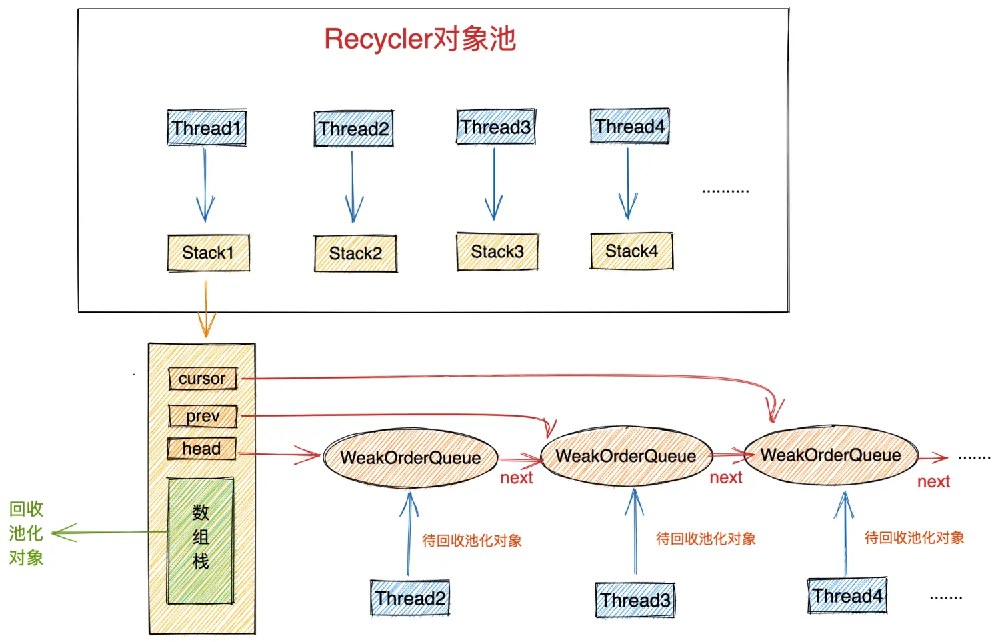​

Recycler对象池.png

### 5.1 多线程获取对象无锁化设计

首先我们从外部整体来看，对象池对于我们来说它就是一个存储对象的池子，当我们需要对象时会从这个池子里直接获取，用完对象时在把对象归还回池子中方便下一次重复使用。

但我们俯瞰整个对象池的设计架构时，我们发现整个设计还是比较复杂其中蕴含了不少精妙的细节。

对象池中最重要的两个结构分别是 Stack 和 WeakOrderQueue。

Stack 中包含一个用数组实现的栈结构（图中绿色部分），这个栈结构正是对象池中真正用于存储池化对象的地方，我们每次从对象池中获取对象都会从这个栈结构中弹出栈顶元素。同样我们每次将使用完的对象归还到对象池中也是将对象压入这个栈结构中。

​**这里有一个精妙的设计**​，我们从图中可以看到每个线程都会拥有一个属于自己的Stack。在我们介绍《对象创建的开销》这一小节内容时，提到为了避免多线程并发申请内存时的同步锁定开销，JVM为每个线程预先申请了一块内存（TLAB）,这样当线程创建对象时都是从自己的TLAB中为对象分配内存。从而避免了多线程之间的同步竞争。

同样当多线程并发从对象池中获取对象时, 如果整个对象池只有一个Stack结构的话，为了保证多线程获取对象的线程安全性，我们只能同步地来访问这个Stack，这样就为对象池的设计引入了多线程同步竞争的开销。

​**为了避免这种不必要的同步竞争，Netty也采用了类似TLAB分配内存的方式，每个线程拥有一个独立Stack，这样当多个线程并发从对象池中获取对象时，都是从自己线程中的Stack中获取，全程无锁化运行。大大提高了多线程从对象池中获取对象的效率**​。

> 这种**多线程并发无锁化**的设计思想，在Netty中比比皆是

### 5.2 Stack的设计

从Recycler对象池的整体设计架构图中我们可以看到，Stack的设计主要分为两个重要的部分：

* 一个是我们前边提到的数组实现的栈结构用来存放对象池中的对象，每个线程绑定一个独立的Stack用来存储由**该线程创建出来**并回收到对象池中的对象。
* 另一个重要的结构是WeakOrderQueue链表，head 指针指向WeakOrderQueue链表的头结点，cursor 指针指向链表的当前节点，prev 指针指向当前节点的前一个节点。WeakOrderQueue链表是用来存储其他线程帮助本线程回收的对象（我们称之为待回收对象）。其中WeakOrderQueue链表中的每一个节点对应一个其他线程，这个其他线程为本线程回收的对象存储在对应的WeakOrderQueue节点中。

> 这里我们先不需要管WeakOrderQueue的具体结构

​**那么Stack结构在设计上为什么要引入这个WeakOrderQueue链表呢**​？

让我们考虑一种多线程回收对象的场景，我们还是以Recycler对象池的整体设计架构图为例。thread1 为当前线程，剩下的thread2 , thread3 , thread4为其他线程。让我们把视角先聚焦在当前线程上。

> 我们先假设Stack结构中只有一个数组栈，并没有WeakOrderQueue链表。看看这样会产生什么后果？

​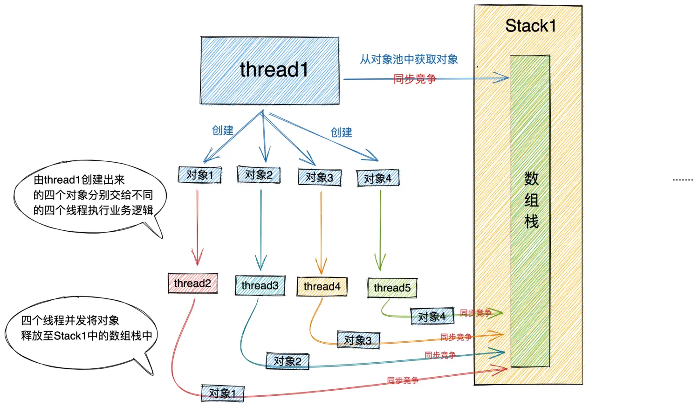​

多线程回收对象的竞争.png

当前线程 thread1 在处理业务逻辑时，创建了一个对象（注意：这个对象是由thread1创建的）如果这是一个单线程处理业务的场景，那么对象会在thread1处理完业务逻辑后被回收至thread1对应的stack1中的数组栈中。当`hread1再次需要创建对象时，会直接从其对应的stack1中的数组栈（图中绿色部分）中直接获取上次回收的对象。

> 由这一点可以看出Stack中的数组栈（绿色部分）存放的是真正被回收的对象，是可以直接被再次获取使用的。

但如果这是一个多线程处理业务场景的话，很可能由thread1创建出来的对象，会被交给thread2或者thread3去处理剩下的业务逻辑，那么当thread2或者thread3这些其他线程处理完业务逻辑时，此时对象的释放并不是在thread1中，而是在其他线程中。

其他线程现在面对的任务就是要将由thread1创建出来的对象，释放回收至thread1对应的stack1中的数组栈中。如果此时多个其他线程并发的向stack1释放回收对象，势必会导致多线程之前的同步竞争，​**Netty将不得不把Stack结构中的数组栈的访问设计成一个同步过程**​。

那么如果此时更不巧的是当前线程thread1又要同时向自己的Stack1获取对象，thread1就只能同步等待，因为此时其他线程正在向Stack1释放对象。

> 本来我们引入对象池的目的就是为了抵消创建对象的开销加快获取对象的速度，减少GC的压力。结果由于Stack的同步访问设计又引入了同步开销。这个同步的开销甚至会比创建对象的开销还要大，那么对象池的引入就变得得不偿失了。

**那么Netty该如何化解这种情况呢？答案还是之前反复强调的无锁化设计思想。**

既然多线程的回收对象场景，会引入多线程之间的同步锁定开销，那么我们就继续采用无锁化的设计思想，为每个线程（注意：这里指的是非创建对象的线程也就是图中的thead2 , thread3 ....）单独分配一个WeakOrderQueue节点，每个线程在为创建线程回收对象时，会将这些对象暂时存放到自己对应的WeakOrderQueue节点中。

> 注意：存放进WeakOrderQueue中的对象我们称为待回收对象，这些待回收对象并不在Stack结构中的数组栈中，因此并不能被直接获取使用。

为了方便后续描述，我们把创建对象的线程称作`创建线程`​（示例中的thread1），将为创建线程回收对象的其他线程称作`回收线程`​（示例中的thread2 , thread3 , thead4 .....）。

我们在将视角拉回到创建线程thread1对应的stack1中，​**每个回收线程将待回收对象放入与自己对应的WeakOrderQueue节点中，这样就避免了在多线程回收场景中的同步竞争**​。当所有回收线程都在为stack1回收对象时，这样在stack1中就形成了一个WeakOrderQueue链表。每个回收线程只操作与自己对应的节点。在Stack结构中通过head，prev，cursor将这些WeakOrderQueue节点组成了一个链表。

> 每一个WeakOrderQueue节点对应一个回收线程。

而当创建线程thread1再次从自己对应的Stack1中获取对象时，只会从Stack结构的数组栈中获取，因为是单线程操作数组栈，自然是不会存在同步竞争的。

当Stack结构中的数组栈没有任何对象时，那么创建线程就会根据 cursor 指针遍历Stack结构中的WeakOrderQueue链表，将当前WeakOrderQueue节点存放的待回收对象​**转移至数组栈中**​。如果WeakOrderQueue链表中也没有任何待回收对象可以转移。那么创建线程在对象池中就直接创建一个对象出来返回。

> 对象池回收对象的一个原则就是对象由谁创建的，最终就要被回收到创建线程对应的Stack结构中的数组栈中。数组栈中存放的才是真正被回收的池化对象，可以直接被取出复用。回收线程只能将待回收对象暂时存放至创建线程对应的Stack结构中的WeakOrderQueue链表中。当数组栈中没有对象时，由创建线程将WeakOrderQueue链表中的待回收对象转移至数组栈中。

**正是由于对象池的这种无锁化设计，对象池在多线程获取对象和多线程回收对象的场景下，均是不需要同步的**

大家在体会下这张图中蕴含的这种​**无锁化设计思想**​：

​​

Recycler对象池.png

### 5.3 WeakOrderQueue的设计

在我们介绍完对象池在多线程回收对象场景下的设计时，我们再来看下用于回收线程存储待回收对象的WeakOrderQueue是如何设计的？

> 注意：这里的回收线程，待回收对象这些概念是我们站在创建线程的视角提出的**相对**概念。

​​

WeakOrderQueue.png

大家一开始可能从WeakOrderQueue字面意思上以为它的结构是一个队列，但实际上从图中我们可以看出WeakOrderQueue的结构其实是一个链表结构。

其中包含了链表的头结点 Head，以及链表尾结点指针 Tail。链表中的元素类型为 Link 类型。

Link 类型中包含了一个 elements 数组，该数组用来存放回收线程收集的待回收对象。

除此之外Link类型中还包含了readIndex用来指示当前elements数组中的读取位置。writeIndex用来指示elements数组的写入位置。elements数组中的容量默认为`16`​，也就是说一个Link节点最多可以存放16个待回收对象。当回收线程收集的待回收对象超过16个时，就会新创建一个Link节点插入到Link链表的尾部。

当需要将WeakoOrderQueue节点中所存放的待回收对象回收转移至其对应的Stack结构中的数组栈中时，**创建线程**会遍历当前WeakOrderQueue节点中的Link链表，然后从链表的Head节点开始，将Head节点中包裹的Link链表头结点中存放的待回收对象回收至创建线程对应的Stack中。​**一次最多转移一个Link大小的待回收对象**​（16个）。

当Link节点中的待回收对象全部转移至创建线程对应的Stack中时，会立马将这个Link节点从当前WeakOrderQueue节点中的Link链表里删除，随后Head节点向后移动指向下一个Link节点。

> head指针始终指向​**第一个未被转移完毕的Link节点**​，创建线程从head节点处读取转移待回收对象，回收线程从Tail节点处插入待回收对象。​**这样转移操作和插入操作互不影响、没有同步的开销**​。

​**注意这里会存在线程可见性的问题**​，也就是说回收线程刚插入的待回收对象，在创建线程转移这些待回收对象时，创建线程可能会**看不到**由回收线程刚刚插入的待回收对象。

​**Netty这里为了不引入多线程同步的开销，只会保证待回收对象的最终可见性**​。 因为如果要保证待回收对象的实时可见性，就要插入一些内存屏障指令，执行这些内存屏障指令也是需要开销的。

事实上这里也并不需要保证实时可见性，创建线程暂时看不到WeakOrderQueue节点中的待回收对象也是没关系的，大不了就新创建一个对象。​**这里还是遵循无锁化的设计思想**​。

> 维护线程之间操作的原子性，可见性都是需要开销的，我们在日常多线程程序设计中一定要根据业务场景来综合考虑，权衡取舍。尽量遵循我们这里多次强调的​**多线程无锁化设计思想**​。提高多线程的运行效率。避免引入不必要的同步开销。

综合以上 Netty Recycler 对象池的设计原理，我们看到多线程从对象池中获取对象，以及多线程回收对象至对象池中，还有创建线程从WeakOrderQueue链表中转移待回收对象到对象池中。这些步骤均是无锁化进行的，没有同步竞争。

在理解了对象池的基本设计原理后，下面就该介绍对象池在Netty中的源码实现环节了。

## 6. Recycler对象池的实现

在小节《4. 对象池Recycler的使用》中我们介绍了Recycler对象池的两个使用案例：

* 一个是对象池在PooledDirectByteBuf类中的运用。
* 另一个是对象池在Channel对应的写入缓冲队列ChannelOutboundBuffer中的运用。

从这两个案例中，我们看到在设计池化对象时，都需要在池化对象内部持有一个对象池的静态引用从而可以与对象池进行交互，引用类型为 ObjectPool ，ObjectPool 是Netty对象池的顶层设计，其中定义了对象池的行为，以及各种顶层接口。

在介绍对象池的整体实现之前，我们先来看下对象池的这个顶层接口设计。

### 6.1 对象池的顶层设计ObjectPool

```java
public abstract class ObjectPool<T> {

    ObjectPool() { }

    public abstract T get();

    public interface Handle<T> {
        void recycle(T self);
    }

    public interface ObjectCreator<T> {
        T newObject(Handle<T> handle);
    }

    ......................省略............

}
```

我们首先看到 ObjecPool 被设计成为一个泛型的抽象类，之所以使用泛型，是因为我们在创建对象池的时候需要指定对象池中被池化对象的类型。

比如《4. 对象池Recycler的使用》小节中的这两个案例：

```java
static final class Entry {

    private static final ObjectPool<Entry> RECYCLER

}
```

```java
final class PooledDirectByteBuf extends PooledByteBuf<ByteBuffer> {

    private static final ObjectPool<PooledDirectByteBuf> RECYCLER

}
```

ObjecPool 定义了从对象池中获取对象的行为：

```java
public abstract T get();
```

将池化对象回收至对象池中的行为被定义在 Handler 内部接口中：

```java
     public interface Handle<T> {
        void recycle(T self);
    } 
```

Handler是池化对象在对象池中的一个模型，Handler里面包裹了池化对象，并包含了池化对象的一些回收信息，以及池化对象的回收状态。它的默认实现是DefaultHandle，后面我们会详细介绍。

> 我们前边介绍到的Stack结构中的数组栈里边存放的就是DefaultHandle，以及WeakOrderQueue结构里的Link节点中的elements数组里存放的也是DefaultHandle。

​**那么为什么要将池化对象的回收行为recycle定义在Handler中，而不是ObejctPool中呢**​？

让我们站在业务线程的角度来看，其实业务线程处理的都是对象级别这个维度，并不需要感知到对象池的存在，使用完对象，直接调用对象的回收方法recycle将池化对象回收掉即可。

在《4. 对象池Recycler的使用》小节我们介绍过池化对象的设计方法，其中我们提到池化对象中需要引用其在对象池中的Handler，这个Handler会在对象池创建对象的时候传入。池化对象类型中需要定义recycle方法，recycle方法清空池化对象的所有属性，并调用Handler的recycle方法将池化对象回收至对象池中。

```java
static final class Entry {

        void recycle() {
            next = null;
            bufs = null;
            buf = null;
            msg = null;
            promise = null;
            progress = 0;
            total = 0;
            pendingSize = 0;
            count = -1;
            cancelled = false;
            handle.recycle(this);
        }

}
```

ObjectPool 还定义了对象池创建对象的行为接口：

```java
    public interface ObjectCreator<T> {
        T newObject(Handle<T> handle);
    }
```

用户在创建对象池的时候，需要通过`ObjectCreator#newObject`​方法指定对象池创建对象的行为。Handler对象正是通过这个接口传入池化对象中的。

```java
  static final class Entry {

      private static final ObjectPool<Entry> RECYCLER = ObjectPool.newPool(new ObjectCreator<Entry>() {
            @Override
            public Entry newObject(Handle<Entry> handle) {
                return new Entry(handle);
            }
        });

      //Entry对象只能通过对象池获取，不可外部自行创建
      private Entry(Handle<Entry> handle) {
            this.handle = handle;
        }

  }
```

#### 6.1.1 创建ObjectPool

​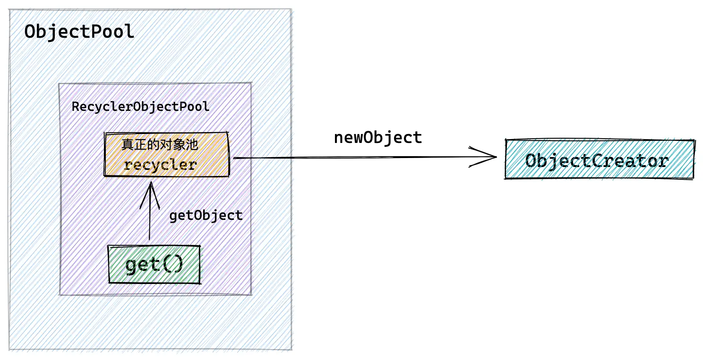​

创建ObjectPool.png

```java
public abstract class ObjectPool<T> {

    public static <T> ObjectPool<T> newPool(final ObjectCreator<T> creator) {
        return new RecyclerObjectPool<T>(ObjectUtil.checkNotNull(creator, "creator"));
    }

    private static final class RecyclerObjectPool<T> extends ObjectPool<T> {
        //recycler对象池实例
        private final Recycler<T> recycler;

        RecyclerObjectPool(final ObjectCreator<T> creator) {
             recycler = new Recycler<T>() {
                @Override
                protected T newObject(Handle<T> handle) {
                    return creator.newObject(handle);
                }
            };
        }

        @Override
        public T get() {
            return recycler.get();
        }
    }

}
```

```java
public abstract class Recycler<T> {

    protected abstract T newObject(Handle<T> handle);
  
    ........................省略.............
}
```

调用 `ObjectPool#newPool`​ 创建对象池时，返回的是 RecyclerObjectPool 实例。而**真正的对象池 Recycler** 被包裹在 RecyclerObjectPool 中。

对象池Recycler创建对象的行为定义在用户在创建对象池时指定的ObjectCreator 中。

## 7. Recycler对象池属性详解

在介绍完对象池的顶层设计之后，接下来我们介绍下Recycler对象池相关的一些重要属性。相信大家在看过前边关于对象池设计原理的介绍之后，现在应该能够比较容易的理解即将介绍的这些属性概念，这里涉及到的属性比较多，笔者把这些属性的介绍放到源码实现之前的目的也是先让大家混个眼熟，先有一个感性的认识，等到介绍源码实现时，笔者还会将涉及到的属性再次拿出来介绍。

​​

image.png

### 7.1 创建线程，回收线程的Id标识

```java
public abstract class Recycler<T> {

    //用于产生池化对象中的回收Id,主要用来标识池化对象被哪个线程回收
    private static final AtomicInteger ID_GENERATOR = new AtomicInteger(Integer.MIN_VALUE);
    //用于标识创建池化对象的线程Id 注意这里是static final字段 也就意味着所有的创建线程OWN_THREAD_ID都是相同的
    //这里主要用来区分创建线程与非创建线程。多个非创建线程拥有各自不同的Id
    //这里的视角只是针对池化对象来说的：区分创建它的线程，与其他回收线程
    private static final int OWN_THREAD_ID = ID_GENERATOR.getAndIncrement();

}
```

* ​`AtomicInteger ID_GENERATOR`​ :对象池中定义了一个 AtomicInteger 类型的Id生成器，主要用于为创建线程以及回收线程创建Id标识，**目的是区分创建线程和回收线程。**
* ​`int OWN_THREAD_ID`​：在 Recycler 类初始化的时候，会利用ID_GENERATOR 为 OWN_THREAD_ID 字段赋值，从字面意思上我们也可以看出 OWN_THREAD_ID 是用来标识创建线程Id的。这里有一点大家需要注意的是，OWN_THREAD_ID 是一个 static final 字段，这也就意味着所有的Recycler对象池实例中的 OWN_THREAD_ID 都是一样的。

这里有的同学可能会有疑问了，在多线程从对象池中获取对象的场景中，创建线程会有很多个（比如下图中的thread1, thread2, thread3.....），既然所有的Recycler 对象池实例中的 OWN_THREAD_ID 都是一样的，那么如何区分不同的创建线程呢？

​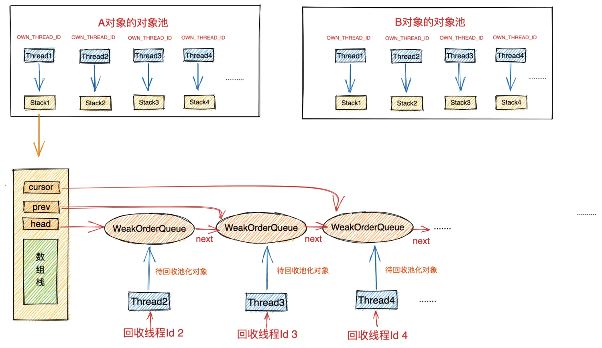​

创建线程与回收线程的Id标识.png

​**事实上在对象池中我们并不需要区分创建线程与创建线程之间的Id**​，因为Netty在设计对象池的时候采用了无锁化设计，创建线程与创建线程之间并不需要交互，每个线程只需要关注自己线程内的对象管理工作即可，所以从一个线程的内部视角来看，只会有一个创建线程就是它自己本身，剩下的线程均是回收线程。​**所以我们对象池的设计中只需要区分创建线程与回收线程就可以了**​，当然每个回收线程的Id是不一样的。

回收线程的Id是由其对应的 WeakOrderQueue 节点来分配的，一个 WeakOrderQueue 实例对应一个回收线程Id。

```java
private static final class WeakOrderQueue extends WeakReference<Thread> {

    //回收线程回收Id,每个weakOrderQueue分配一个，同一个stack下的一个回收线程对应一个weakOrderQueue节点
   private final int id = ID_GENERATOR.getAndIncrement();
}
```

### 7.2 对象池中的容量控制

​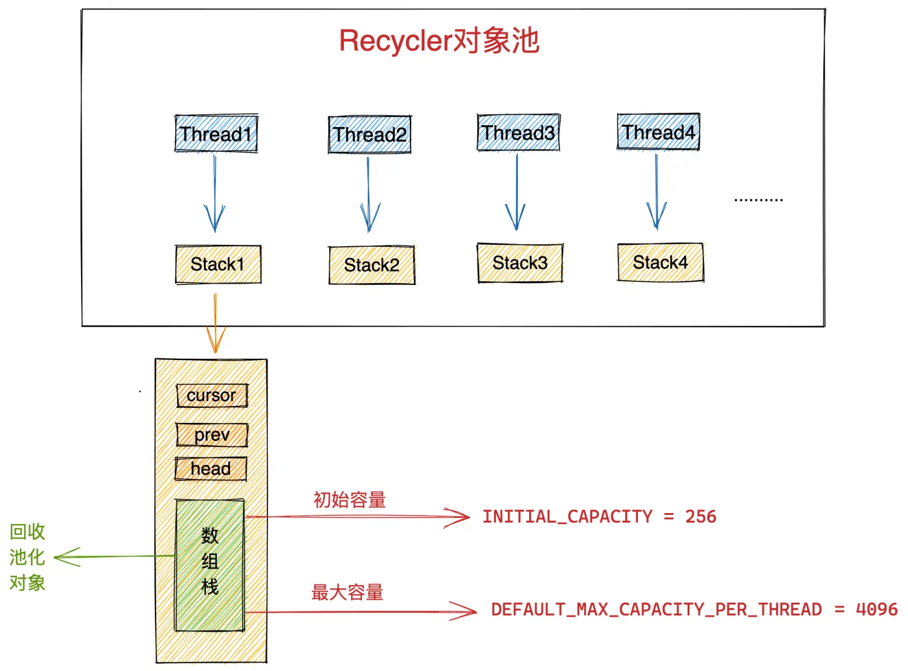​

对象池容量.png

```java
    //对象池中每个线程对应的Stack中可以存储池化对象的默认初始最大个数 默认为4096个对象 
    private static final int DEFAULT_INITIAL_MAX_CAPACITY_PER_THREAD = 4 * 1024; // Use 4k instances as default.
    // 对象池中线程对应的Stack可以存储池化对象默认最大个数 4096
    private static final int DEFAULT_MAX_CAPACITY_PER_THREAD;
    // 初始容量 min(DEFAULT_MAX_CAPACITY_PER_THREAD, 256) 初始容量不超过256个
    private static final int INITIAL_CAPACITY;
```

Recycler 对象池中定义了以上三个属性用于控制对象池中可以池化的对象容量。这些属性对应的初始化逻辑如下：

```java
    static {

        int maxCapacityPerThread = SystemPropertyUtil.getInt("io.netty.recycler.maxCapacityPerThread",
                SystemPropertyUtil.getInt("io.netty.recycler.maxCapacity", DEFAULT_INITIAL_MAX_CAPACITY_PER_THREAD));
        if (maxCapacityPerThread < 0) {
            maxCapacityPerThread = DEFAULT_INITIAL_MAX_CAPACITY_PER_THREAD;
        }

        DEFAULT_MAX_CAPACITY_PER_THREAD = maxCapacityPerThread;

        INITIAL_CAPACITY = min(DEFAULT_MAX_CAPACITY_PER_THREAD, 256);
    }
```

* ​`DEFAULT_INITIAL_MAX_CAPACITY_PER_THREAD`​：定义每个创建线程对应的Stack结构中的数组栈初始默认的最大容量。默认为4096个。可由JVM启动参数 `-D io.netty.recycler.maxCapacity`​ 指定。
* ​`DEFAULT_MAX_CAPACITY_PER_THREAD`​：定义每个创建线程对应的Stack结构中的数组栈的最大容量。可由JVM启动参数 `-D io.netty.recycler.maxCapacityPerThread`​ 指定，如无特殊指定，即采用 DEFAULT_INITIAL_MAX_CAPACITY_PER_THREAD 的值，默认为4096个。
* ​`INITIAL_CAPACITY`​: 定义每个创建线程对应的Stack结构中的数组栈的初始容量。计算公式为`min(DEFAULT_MAX_CAPACITY_PER_THREAD, 256)`​，默认为256个。当池化对象超过256个时，则对对象池进行扩容，但不能超过最大容量 DEFAULT_MAX_CAPACITY_PER_THREAD。

### 7.3 回收线程可回收对象的容量控制

```java
   //用于计算回收线程可帮助回收的最大容量因子  默认为2  
    private static final int MAX_SHARED_CAPACITY_FACTOR;
    //每个回收线程最多可以帮助多少个创建线程回收对象 默认：cpu核数 * 2
    private static final int MAX_DELAYED_QUEUES_PER_THREAD;
    //回收线程对应的WeakOrderQueue节点中的Link链表中的节点存储待回收对象的容量 默认为16
    private static final int LINK_CAPACITY;
```

Recycler 对象池除了对创建线程中的 Stack 容量进行限制外，还需要对回收线程可回收对象的容量进行限制。相关回收容量限制属性初始化逻辑如下：

```java
    static {

        MAX_SHARED_CAPACITY_FACTOR = max(2,
                SystemPropertyUtil.getInt("io.netty.recycler.maxSharedCapacityFactor",
                        2));

        MAX_DELAYED_QUEUES_PER_THREAD = max(0,
                SystemPropertyUtil.getInt("io.netty.recycler.maxDelayedQueuesPerThread",
                        // We use the same value as default EventLoop number
                        NettyRuntime.availableProcessors() * 2));

        LINK_CAPACITY = safeFindNextPositivePowerOfTwo(
                max(SystemPropertyUtil.getInt("io.netty.recycler.linkCapacity", 16), 16));

    }
```

* ​`MAX_SHARED_CAPACITY_FACTOR`​ : 针对创建线程中的 Stack，其对应的所有回收线程总共可帮助其回收的对象总量计算因子。默认为2。可通过JVM参数 `-D io.netty.recycler.maxSharedCapacityFactor`​ 指定，总共回收对象总量就是通过对象池的最大容量和该计算因子计算出来的。计算公式： `max(maxCapacity / maxSharedCapacityFactor, LINK_CAPACITY)`​ 。由此我们可以知道创建线程对应的所有回收线程总共可帮助其回收的对象总量默认为2048个，最小回收容量为 LINK_CAPACITY  默认为16。
* ​`MAX_DELAYED_QUEUES_PER_THREAD`​ : 该参数定义每个回收线程最多可帮助多少个创建线程回收对象。默认为：CPU核数 * 2。可通过JVM参数 `-D io.netty.recycler.maxDelayedQueuesPerThread`​ 指定。​**注意：这里是站在回收线程的角度**​。
* ​`LINK_CAPACITY`​:  在创建线程对应的 Stack 结构中的 WeakOrderQueue 链表中，回收线程对应的WeakOrderQueue节点中的Link链表中的Link节点存储待回收对象的容量。默认为16，可通过JVM参数 `-D io.netty.recycler.linkCapacity`​ 指定。

为了方便大家理解这些容量控制的相关参数，笔者又在对象池架构设计图的基础上补充了容量控制相关的信息。大家可以对照上边介绍到的这些参数的含义形象体会下：

​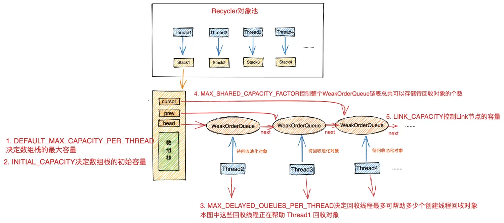​

对象池容量控制.png

### 7.4 对象回收频率控制

对象池不能不考虑容量的限制而无脑的进行对象的回收，而是要对回收对象的频率进行限制。在我们日常架构设计和程序设计时，我们也一定要有托底的方案，比如限流，降级，熔断等托底方案。这样程序就不至于被突发的异常流量击垮。

在对象池的设计中，Netty用以下两个参数来控制对象回收的频率从而避免对象池迅速膨胀不可控制。

```java
    //创建线程回收对象时的回收比例，默认是8，表示只回收1/8的对象。也就是产生8个对象回收一个对象到对象池中
    private static final int RATIO;
    //回收线程回收对象时的回收比例，默认也是8，同样也是为了避免回收线程回收队列疯狂增长 回收比例也是1/8
    private static final int DELAYED_QUEUE_RATIO;
```

对象回收频率控制参数的初始化逻辑如下：

```java
    static {

        RATIO = max(0, SystemPropertyUtil.getInt("io.netty.recycler.ratio", 8));

        DELAYED_QUEUE_RATIO = max(0, SystemPropertyUtil.getInt("io.netty.recycler.delayedQueue.ratio", RATIO));

    }
```

通过前边对 Recycler 对象池的设计原理介绍，我们知道，在池化对象被回收的时候分别由两类线程来执行。

* 一类是创建线程。池化对象在创建线程中被创建出来后，一直在创建线程中被处理，处理完毕后由创建线程直接进行回收。而为了避免对象池不可控制地迅速膨胀，所以需要对创建线程回收对象的频率进行限制。这个回收频率由参数 RATIO 控制，默认为8，可由JVM启动参数 `-D io.netty.recycler.ratio`​ 指定。表示创建线程只回收 1 / 8 的对象，也就是每创建 8 个对象最后只回收 1个对象。
* 另一类就是回收线程。池化对象在创建线程中被创建出来，但是业务的相关处理是在回收线程中，业务处理完毕后由回收线程负责回收。前边提到对象回收有一个基本原则就是对象是谁创建的，就要回收到创建线程对应的Stack中。所以回收线程就需要将池化对象回收至其创建线程对应的Stack中的WeakOrderQueue链表中。并等待创建线程将WeakOrderQueue链表中的待回收对象**转移**至Stack中的数组栈中。同样，回收线程也需要控制回收频率，由参数 DELAYED_QUEUE_RATIO 进行控制，默认也是8，可由JVM启动参数 `-D io.netty.recycler.delayedQueue.ratio`​ 指定，表示回收线程每处理完 8 个对象才回收 1 个对象。

## 8. Recycler对象池的创建

```java
    private static final class RecyclerObjectPool<T> extends ObjectPool<T> {
        //recycler对象池实例
        private final Recycler<T> recycler;

        RecyclerObjectPool(final ObjectCreator<T> creator) {
             recycler = new Recycler<T>() {
                @Override
                protected T newObject(Handle<T> handle) {
                    return creator.newObject(handle);
                }
            };
        }
    
        ..................省略............
      }
```

Netty 中的 Recycler 对象池是一个抽象类，里面封装了对象池的核心结构以及核心方法。在创建对象池的时候，我们往往会使用Recycler的匿名类来实现抽象方法 newObject 从而来定义对象池创建对象的行为。

```java
public abstract class Recycler<T> {

   protected abstract T newObject(Handle<T> handle);

   protected Recycler() {
        this(DEFAULT_MAX_CAPACITY_PER_THREAD);
    }

    protected Recycler(int maxCapacityPerThread) {
        this(maxCapacityPerThread, MAX_SHARED_CAPACITY_FACTOR);
    }

    protected Recycler(int maxCapacityPerThread, int maxSharedCapacityFactor) {
        this(maxCapacityPerThread, maxSharedCapacityFactor, RATIO, MAX_DELAYED_QUEUES_PER_THREAD);
    }

    protected Recycler(int maxCapacityPerThread, int maxSharedCapacityFactor,
                       int ratio, int maxDelayedQueuesPerThread) {
        this(maxCapacityPerThread, maxSharedCapacityFactor, ratio, maxDelayedQueuesPerThread,
                DELAYED_QUEUE_RATIO);
    }

    //创建线程持有对象池的最大容量
    private final int maxCapacityPerThread;
    //所有回收线程可回收对象的总量(计算因子)
    private final int maxSharedCapacityFactor;
    //创建线程的回收比例
    private final int interval;
    //一个回收线程可帮助多少个创建线程回收对象
    private final int maxDelayedQueuesPerThread;
    //回收线程回收比例
    private final int delayedQueueInterval;

    protected Recycler(int maxCapacityPerThread, int maxSharedCapacityFactor,
                       int ratio, int maxDelayedQueuesPerThread, int delayedQueueRatio) {
        interval = max(0, ratio);
        delayedQueueInterval = max(0, delayedQueueRatio);
        if (maxCapacityPerThread <= 0) {
            this.maxCapacityPerThread = 0;
            this.maxSharedCapacityFactor = 1;
            this.maxDelayedQueuesPerThread = 0;
        } else {
            this.maxCapacityPerThread = maxCapacityPerThread;
            this.maxSharedCapacityFactor = max(1, maxSharedCapacityFactor);
            this.maxDelayedQueuesPerThread = max(0, maxDelayedQueuesPerThread);
        }
    }

}
```

关于Recycler对象池中相关的重要属性我们在上一小节已经详细介绍过了，这里只是将这些重要参数赋值于Recycler对象池中定义的对应属性上。还是那句话，大家这里只需要对这些属性有一个感性的认识即可，并不需要强行完全理解，后面我们在介绍对象池的功能实现时还会结合具体场景来介绍这些属性。

## 9. 多线程获取对象无锁化实现

​​

Recycler对象池.png

我们在介绍Netty对象池多线程获取对象的设计时提到，为了避免多线程并发获取对象时引入的同步开销，Netty采用了类似 TLAB 分配内存的思想，为每一个线程分配了一个独立的Stack结构，池化对象就存储在这个Stack结构中。当线程需要从对象池中获取对象时，Recycler就会从线程对应的Stakc结构中获取池化对象。各个线程独立运行，没有任何同步开销。

```java
    //threadlocal保存每个线程对应的 stack结构
    private final FastThreadLocal<Stack<T>> threadLocal = new FastThreadLocal<Stack<T>>() {
        @Override
        protected Stack<T> initialValue() {
            return new Stack<T>(Recycler.this, Thread.currentThread(), maxCapacityPerThread, maxSharedCapacityFactor,
                    interval, maxDelayedQueuesPerThread, delayedQueueInterval);
        }
      
        ..............省略..........
    };
```

对象池中采用一个 FastThreadLocal 类型的字段 threadLocal 为每个线程维护一个独立的Stack结构。从而达到多线程无锁化获取对象的目的。

> FastThreadLocal是Netty基于JDK的ThreadLocal做的一个优化版本，拥有更快的访问性能。详细实现笔者后面会有一篇专门讲解FastThreadLocal的文章，这里大家只需要把它当成JDK的ThreadLocal来看待即可。

当线程第一次从对象池中获取对象时会触发其对应的Stack结构的创建。

### 9.1 Stack结构的创建

本小节我们来介绍一下对象池中Stack结构的设计实现。在前边《5.2 Stack的设计》小节中我们介绍了Stack结构中的一些核心属性，包括：数组栈以及WeakOrderQueue链表的Head指针，Prev指针，Cursor指针。

本小节笔者会把Stack结构中的剩余属性介绍给大家，通过这一小节的介绍，相信大家就会对Stack的设计实现有了一个整体的了解。还是那句话，这里大家只需要对这些属性有一个感性的认识，先混个眼熟，后面笔者还会结合具体场景详细讲解。

```java
private static final class Stack<T> {

        // 创建线程保存池化对象的stack结构所属对象池recycler实例
        final Recycler<T> parent;

        //用弱引用来关联当前stack对应的创建线程 因为用户可能在某个地方引用了defaultHandler -> stack -> thread，可能存在这个引用链
        //当创建线程死掉之后 可能因为这个引用链的存在而导致thread无法被回收掉
        final WeakReference<Thread> threadRef;

        //所有回收线程能够帮助当前创建线程回收对象的总容量
        final AtomicInteger availableSharedCapacity;

        //当前Stack对应的创建线程作为其他创建线程的回收线程时可以帮助多少个线程回收其池化对象
        private final int maxDelayedQueues;

        //当前创建线程对应的stack结构中的最大容量。 默认4096个对象
        private final int maxCapacity;

        //当前创建线程回收对象时的回收比例
        private final int interval;

        //当前创建线程作为其他线程的回收线程时回收其他线程的池化对象比例
        private final int delayedQueueInterval;

        // 当前Stack中的数组栈 默认初始容量256，最大容量为4096
        DefaultHandle<?>[] elements;

        //数组栈 栈顶指针
        int size;

        //回收对象计数 与 interval配合 实现只回收一定比例的池化对象
        private int handleRecycleCount;

        //多线程回收的设计，核心还是无锁化，避免多线程回收相互竞争
        //Stack结构中的WeakOrderQueue链表
        private WeakOrderQueue cursor, prev;
        private volatile WeakOrderQueue head;
}
```

​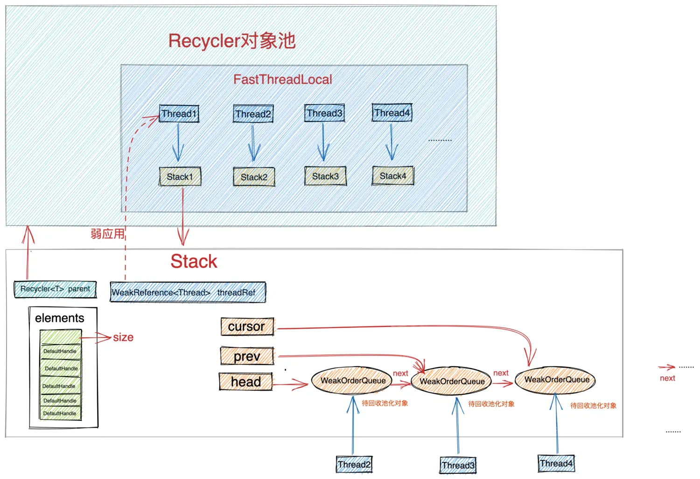​

Stack结构.png

* ​`Recycler<T> parent`​：Stack所属Recycler对象池实例，一个对象池可被多个线程访问获取对象，所以一个对象池对应多个Stack，每个Stack的parent属性指向所属的Recycler实例。比如图中的 stack1 , stack2 , stack3 , stack4 中的parent属性均指向同一个Recycler对象池实例。
* ​`WeakReference<Thread> threadRef`​：Stack会通过弱引用的方式引用到其对应的创建线程。这里使用弱引用来持有对应创建线程的原因是因为对象池的设计中存在这样一个引用关系：`池化对象 -> DefaultHandler -> stack -> threadRef`​。而池化对象是暴露给用户的，如果用户在某个地方持有了池化对象的强引用忘记清理，而Stack持有创建线程的强引用的话，当创建线程死掉的之后，因为这样一个强引用链的存在从而导致创建线程一直不能被GC回收。
* ​`AtomicInteger availableSharedCapacity`​：当前创建线程对应的所有回收线程可以帮助当前创建线程回收的对象总量。比如图中thread2 , thread3 , thread4 这三个回收线程总共可以帮助 thread1 回收对象的总量。availableSharedCapacity 在多个回收线程中是​**共享的**​，回收线程每回收一个对象它的值就会减1，当小于 LINK_CAPACITY(回收线程对应WeakOrderQueue节点的最小存储单元Link)时，回收线程将不能在为该stack回收对象了。该值的计算公式为前边介绍的 `max(maxCapacity / maxSharedCapacityFactor, LINK_CAPACITY)`​。

> 当创建线程从Stack结构中的WeakOrderQueue链表中转移待回收对象到数组栈中后，availableSharedCapacity 的值也会相应增加。说白了这个值就是用来指示回收线程还能继续回收多少对象。已达到控制回收线程回收对象的总体容量。

* ​`int maxDelayedQueues`​： 一个线程对于对象池来说，它可以是创建线程，也可以是回收线程，当该创建线程作为回收线程时，该值定义了最多可以为多少个创建线程回收对象。默认值为 CPU * 2。比如图中 thread2 作为回收线程既可以帮 thread1 回收对象也可以帮助 thread3 , thread4 回收对象。那么maxDelayedQueues 的值就是 3 。
* ​`int maxCapacity`​：定义当前Stack结构中的数组栈的最大容量。默认为4096。
* ​`int interval`​：创建线程的回收比例，默认是8。
* ​`int delayedQueueInterval`​：创建线程作为回收线程时的回收比例。默认是8。
* ​`DefaultHandle<?>[] elements`​：这个就是我们前边反复提到的Stack结构中的数组栈。用于存放对象池中的池化对象。当线程从对象池中获取对象时就是从这里获取。
* ​`int size`​：数组栈中的栈顶指针。
* ​`int handleRecycleCount`​：回收对象计数。与 interval 配合达到控制回收对象比例的目的。从 0 开始每遇到一个回收对象就 +1 ，同时把对象丢弃。直到`handleRecycleCount == interval`​时回收对象，然后归零。也就是前边我们说到的每创建8个对象才回收1个。避免 Stack 不可控制的迅速增长。
* ​`WeakOrderQueue cursor, prev，head`​：这三个指针就是前边我们在讲Stack设计的时候介绍到的用于**多线程无锁化回收**的 WeakOrderQueue 链表中的头结点指针，当前节点指针，前一个节点指针（用于删除节点）。

介绍完Stack结构中的这些重要属性，创建的过程就很简单了。就是利用前边介绍过的已经初始化好的Recycler属性对Stack结构中的这些属性进行赋值。

```java
    private final FastThreadLocal<Stack<T>> threadLocal = new FastThreadLocal<Stack<T>>() {
        @Override
        protected Stack<T> initialValue() {
            return new Stack<T>(Recycler.this, Thread.currentThread(), maxCapacityPerThread, maxSharedCapacityFactor,
                    interval, maxDelayedQueuesPerThread, delayedQueueInterval);
        }

      ..............省略............
    }
```

```java
       Stack(Recycler<T> parent, Thread thread, int maxCapacity, int maxSharedCapacityFactor,
              int interval, int maxDelayedQueues, int delayedQueueInterval) {
            this.parent = parent;
            threadRef = new WeakReference<Thread>(thread);
            this.maxCapacity = maxCapacity;
            availableSharedCapacity = new AtomicInteger(max(maxCapacity / maxSharedCapacityFactor, LINK_CAPACITY));
            elements = new DefaultHandle[min(INITIAL_CAPACITY, maxCapacity)];
            this.interval = interval;
            this.delayedQueueInterval = delayedQueueInterval;
            handleRecycleCount = interval; 
            this.maxDelayedQueues = maxDelayedQueues;
        }
```

### 9.2 从对象池中获取对象

​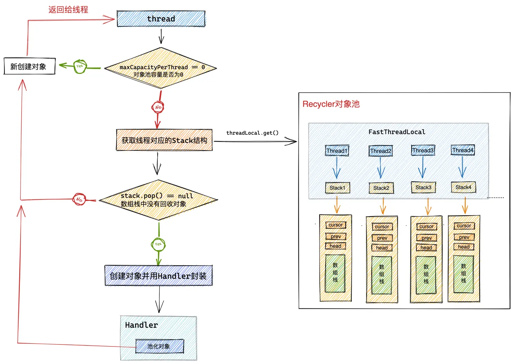​

从对象池中获取对象.png

```java
public abstract class Recycler<T> {
      //一个空的Handler,表示该对象不会被池化
     private static final Handle NOOP_HANDLE = new Handle() {
        @Override
        public void recycle(Object object) {
            // NOOP
        }
    };

    public final T get() {
        //如果对象池容量为0，则立马新创建一个对象返回，但是该对象不会回收进对象池
        if (maxCapacityPerThread == 0) {
            return newObject((Handle<T>) NOOP_HANDLE);
        }
        //获取当前线程 保存池化对象的stack
        Stack<T> stack = threadLocal.get();
        //从stack中pop出对象，handler是池化对象在对象池中的模型，包装了一些池化对象的回收信息和回收状态
        DefaultHandle<T> handle = stack.pop();
        //如果当前线程的stack中没有池化对象 则直接创建对象
        if (handle == null) {
            //初始化的handler对象recycleId和lastRecyclerId均为0
            handle = stack.newHandle();
            //newObject为对象池recycler的抽象方法，由使用者初始化内存池的时候 匿名提供
            handle.value = newObject(handle);
        }
        return (T) handle.value;
    }

}
```

Recycler对外表现为一个整体的对象池，但是对象池内部是按照线程的维度来池化对象的，每个线程所池化的对象保存在对应的Stack结构中。

1. 当对象池的最大容量`maxCapacityPerThread == 0`​时，对象池会立马创建一个对象出来，并将一个空的Handler传递进对象中。表示该对象在使用完毕后不会被回收进对象池中。
2. 从threadLocal中获取当前线程对应的Stack，随后从Stack结构中的数组栈中弹出栈顶对象的DefaultHandler。
3. 如果弹出的DefaultHandler为空，说明当前Stack中并没有回收的池化对象。直接创建一个新的DefaultHandler并创建一个新的对象，然后将DefaultHandler传入到新创建的对象中，并用DefaultHandler包裹新创建的对象。这样池化对象就与DefaultHandler关联起来了。

```java
static final class Entry {

     private static final ObjectPool<Entry> RECYCLER = ObjectPool.newPool(new ObjectCreator<Entry>() {
            @Override
            public Entry newObject(Handle<Entry> handle) {
                return new Entry(handle);
            }
        });

     private Entry(Handle<Entry> handle) {
            this.handle = handle;
     }
}
```

### 9.3 DefaultHandler

前边我们在介绍对象池的设计原理时提到，池化对象在对象池中的存储模型为 Handler。

```java
public abstract class ObjectPool<T> {

    public interface Handle<T> {
        void recycle(T self);
    }

}
```

在Recycler对象池中的默认实现是 DefaultHandler ，DefaultHandler 里面包裹了池化对象以及池化对象在对象池中的一些相关信息，（比如：池化对象的相关回收信息和回收状态）。

从结构设计角度上来说，池化对象是隶属于其创建线程对应的Stack结构的，由于这层结构关系的存在，池化对象的DefaultHandler应该由Stack来进行创建。

```java
 private static final class Stack<T> {

        DefaultHandle<T> newHandle() {
            return new DefaultHandle<T>(this);
        }
 }
```

我们来看下 DefaultHandler 的具体结构：

```java
   private static final class DefaultHandle<T> implements Handle<T> {
        //用于标识最近被哪个线程回收，被回收之前均是0
        int lastRecycledId;
        //用于标识最终被哪个线程回收，在没被回收前是0
        int recycleId;

        //是否已经被回收
        boolean hasBeenRecycled;
        //强引用关联创建handler的stack
        Stack<?> stack;
        //池化对象
        Object value;

        DefaultHandle(Stack<?> stack) {
            this.stack = stack;
        }

        @Override
        public void recycle(Object object) {

          ...................省略.............
        }
    }
```

DefaultHandler属性的第一部分信息，首先就是池化对象在对象池中的回收信息。

* ​`int lastRecycledId`​：用于标识最近被哪个线程回收，被回收之前均是0。
* ​`int recycleId`​：用于标识最终被哪个线程回收，在没被回收前是0。
* ​`boolean hasBeenRecycled`​：该池化对象是否已经被回收至创建线程对应的Stack中。

​**这里可能大家有疑问了，为什么池化对象的回收还要分最近回收和最终回收呢**​？

因为对象池中的池化对象回收可以分为两种情况：

* ​`由创建线程直接进行回收`​：这种回收情况就是一步到位，直接回收至创建线程对应的Stack中。所以这种情况下是不分阶段的。`recycleId = lastRecycledId = OWN_THREAD_ID`​。
* ​`由回收线程帮助回收`​：这种回收情况下就要分步进行了，首先由回收线程将池化对象**暂时存储**在其创建线程对应Stack中的WeakOrderQueue链表中。此时并没有完成真正的对象回收。`recycleId = 0，lastRecycledId = 回收线程Id（WeakOrderQueue#id）`​。当创建线程将WeakOrderQueue链表中的待回收对象转移至Stack结构中的数组栈之后，这时池化对象才算真正完成了回收动作。`recycleId = lastRecycledId = 回收线程Id（WeakOrderQueue#id）`​。

这两个字段 lastRecycledId ，recycleId 主要是用来标记池化对象所处的回收阶段，以及在这些回收阶段具体被哪个线程进行回收。

最后两个属性就比较容易理解了，一个是 Object value 用来包裹真正的池化对象。另一个是 Stack<?> stack 用来强引用关联池化对象的Handler所属的Stack结构。

记不记得我们在介绍Stack结构的时候提到，Stack中持有其对应创建线程的`弱引用`​。笔者在解释为什么持有创建线程的弱引用时，提到过这样一个引用链关系：`池化对象 -> DefaultHandler -> Stack -> threadRef`​。这里大家明白了吗？

​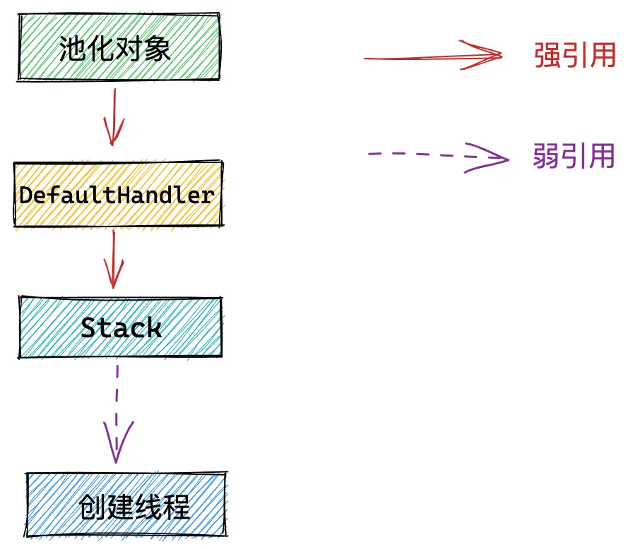​

创建线程引用链.png

```java
static final class Entry {
    //池化对象Entry强引用它的DefaultHandler
    private  Handle<Entry> handle;
  
}


private static final class DefaultHandle<T> implements Handle<T> {
    // DefaultHandler强引用其所属的Stack
    Stack<?> stack;

}

private static final class Stack<T> {
    // Stack弱引用其对应的创建线程
    final WeakReference<Thread> threadRef;

}
```

### 9.4 从Stack中获取池化对象

​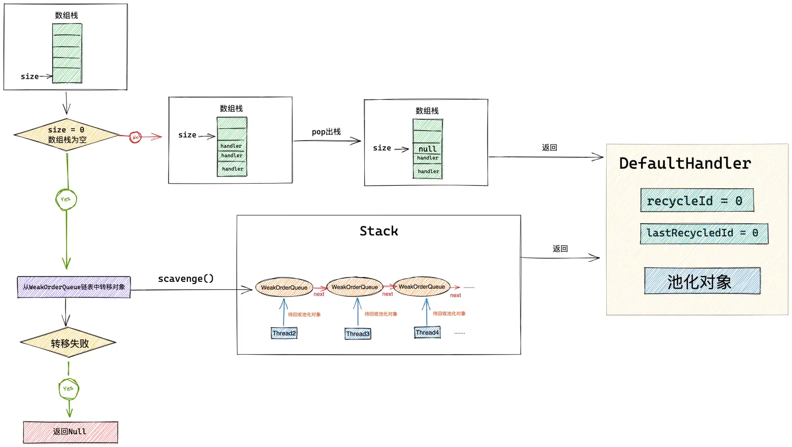​

从Stack中获取对象.png

```java
        DefaultHandle<T> pop() {
            //普通出栈操作，从栈顶弹出一个回收对象
            int size = this.size;
            if (size == 0) {
                //如果当前线程所属stack已经没有对象可用，则遍历stack中的weakOrderQueue链表（其他线程帮助回收的对象存放在这里）将这些待回收对象回收进stack
                if (!scavenge()) {
                    return null;
                }
                size = this.size;
                if (size <= 0) {
                    // 如果WeakOrderQueue链表中也没有待回收对象可转移
                    // 直接返回null 新创建一个对象
                    return null;
                }
            }
            size --;
            DefaultHandle ret = elements[size];
            elements[size] = null;
            this.size = size;

            if (ret.lastRecycledId != ret.recycleId) {
                // 这种情况表示对象至少被一个线程回收了，要么是创建线程，要么是回收线程
                throw new IllegalStateException("recycled multiple times");
            }

            //对象初次创建以及回收对象再次使用时  它的 recycleId = lastRecycleId = 0
            ret.recycleId = 0;
            ret.lastRecycledId = 0;
            return ret;
        }
```

这里就是业务线程从对象池中真正获取池化对象的地方。从Stack结构中的数组栈的栈顶位置弹出池化对象。

* 首先判断数组栈中是否有回收的池化对象。栈顶指针 size == 0 说明当前数组栈中是空的。随后就会调用 scavenge 方法，从Stack结构中的WeakOrderQueue链表中转移最多一个Link大小的待回收对象到数组栈中。如果WeakOrderQueue链表中也没有待回收对象，说明当前Stack结构就是空的没有任何回收的池化对象，对象池直接返回 null ，并创建一个新的池化对象返回给业务线程。
* 如果数组栈不为空，则将栈顶元素 DefaultHandler 弹出，初始化池化对象DefaultHandler的回收信息。`recycleId = lastRecycledId = 0`​表示该池化对象刚刚从对象池中取出。

recycleId 与 lastRecycledId 之间的关系分为以下几种情况：

* ​`recycleId = lastRecycledId = 0`​：表示池化对象刚刚被创建或者刚刚从对象池中取出即将被再次复用。这是池化对象的初始状态。
* ​`recycleId = lastRecycledId != 0`​：表示当前池化对象已经被回收至对应Stack结构里的数组栈中。可以直接被取出复用。可能是被其创建线程直接回收，也可能是被回收线程回收。
* ​`recycleId != lastRecycledId`​：表示当前池化对象处于半回收状态。池化对象已经被业务线程处理完毕，并被回收线程回收至对应的WeakOrderQueue节点中。并等待创建线程将其最终转移至Stack结构中的数组栈中。

### 9.4 转移回收线程回收的对象到Stack中

​​

Stack结构.png

通过前边介绍Stack结构的设计原理我们知道，对象池中池化对象的回收存储分为两个部分：

* 一个是池化对象直接被创建线程回收，直接存储在创建线程对应Stack结构中的数组栈中。
* 另一个是池化对象被回收线程回收，临时间接存储在创建线程对应Stack结构中的WeakOrderQueue链表中。每个回收线程对应一个WeakOrderQueue节点。

当Stack结构中的数组栈为空时，创建线程会遍历WeakOrderQueue链表，从而将回收线程为其回收的对象从WeakOrderQueue节点中转移至数组栈中。**多线程回收对象无锁化设计**

这个转移的动作就是由 scavenge 方法来完成的。

```java
       private boolean scavenge() {
            //从其他线程回收的weakOrderQueue里 转移 待回收对像 到当前线程的stack中
            if (scavengeSome()) {
                return true;
            }

            // 如果weakOrderQueue中没有待回收对象可转移，那么就重置stack中的cursor.prev
            // 因为在扫描weakOrderQueue链表的过程中，cursor已经发生变化了
            prev = null;
            cursor = head;
            return false;
        }
```

scavengeSome() 执行具体的转移逻辑。如果WeakOrderQueue链表中还有待回收对象并转移成功则返回 true 。如果WeakOrderQueue链表为空没有任何待回收对象可转移，则重置链表相关的指针，cursor重新指向head节点，prev指向null。因为在遍历WeakOrderQueue链表搜寻可转移对象时，cursor指针已经发生变化了，这里需要重置。

### 9.5 转移回收对象

下面创建线程就开始遍历Stack结构中的WeakOrderQueue链表，将其中存储的回收线程回收进来的对象转移到数组栈中。

为了让大家更清晰的理解遍历WeakOrderQueue链表的过程，我们先来了解下Stack中WeakOrderQueue链表的状态结构如下图所示：

​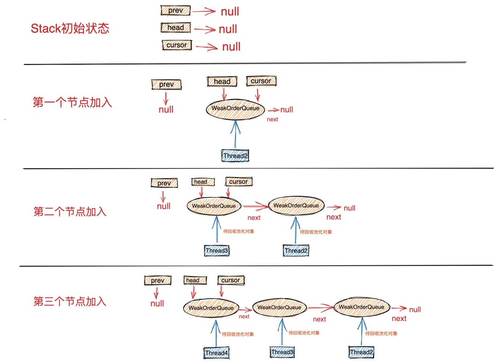​

Stack链表的插入.png

在Stack结构刚刚创建的初始状态，WeakOrderQueue链表是空的，所以 prev = head = cursor = null 。

后面当回收线程在回收对象时会加入自己对应的WeakOrderQueue节点到链表中。​**注意：WeakOrderQueue节点的插入都是在链表的头结点进行插入**​。

> 后面我们在讲到多线程回收对象时还会再次详细讲解WeakOrderQueue链表的操作，这里大家只需要先理解链表的状态结构即可。

head指针始终指向链表的头结点，cursor指针指向当前遍历的节点。在没有开始遍历链表前，cursor指针指向头结点。表示从头结点开始遍历。prev指针指向cursor前一个节点。当前遍历节点为头结点时，prev指针指向空。

在理解了WeakOrderQueue链表的状态结构后，我们来看一下链表的遍历转移过程逻辑：

```java
        private boolean scavengeSome() {
            WeakOrderQueue prev;
            //获取当前线程stack 的weakOrderQueue链表指针（本次扫描起始节点）
            WeakOrderQueue cursor = this.cursor;
            //在stack初始化完成后，cursor，prev,head等指针全部是null，这里如果cursor == null 意味着当前stack第一次开始扫描weakOrderQueue链表
            if (cursor == null) {
                prev = null;
                cursor = head;
                if (cursor == null) {
                    //说明目前weakOrderQueue链表里还没有节点，并没有其他线程帮助回收的池化对象
                    return false;
                }
            } else {
                //获取prev指针，用于操作链表（删除当前cursor节点）
                prev = this.prev;
            }

            boolean success = false;
            //循环遍历weakOrderQueue链表 转移待回收对象
            do {
                //将weakOrderQueue链表中当前节点中包含的待回收对象，转移到当前stack中，一次转移一个link
                if (cursor.transfer(this)) {
                    success = true;
                    break;
                }
                //如果当前cursor节点没有待回收对象可转移，那么就继续遍历链表获取下一个weakOrderQueue节点
                WeakOrderQueue next = cursor.getNext();
                //如果当前weakOrderQueue对应的回收线程已经挂掉了，则
                if (cursor.get() == null) {
                    // 判断当前weakOrderQueue节点是否还有可回收对象
                    if (cursor.hasFinalData()) {
                        //回收weakOrderQueue中最后一点可回收对象，因为对应的回收线程已经死掉了，这个weakOrderQueue不会再有任何对象了
                        for (;;) {

                            if (cursor.transfer(this)) {
                                success = true;
                            } else {
                                break;
                            }
                        }
                    }

                    //回收线程以死，对应的weaoOrderQueue节点中的最后一点待回收对象也已经回收完毕，就需要将当前节点从链表中删除。unlink当前cursor节点
                    //这里需要注意的是，netty永远不会删除第一个节点，因为更新头结点是一个同步方法，避免更新头结点而导致的竞争开销
                    // prev == null 说明当前cursor节点是头结点。不用unlink，如果不是头结点 就将其从链表中删除，因为这个节点不会再有线程来收集池化对象了
                    if (prev != null) {
                        //确保当前weakOrderQueue节点在被GC之前，我们已经回收掉它所有的占用空间
                        cursor.reclaimAllSpaceAndUnlink();
                        //利用prev指针删除cursor节点
                        prev.setNext(next);
                    }
                } else {
                    prev = cursor;
                }
                //向后移动prev,cursor指针继续遍历weakOrderQueue链表
                cursor = next;

            } while (cursor != null && !success);

            this.prev = prev;
            this.cursor = cursor;
            return success;
        }
```

1. 再开始遍历WeakOrderQueue链表之前，首先需要检查cursor指针是否为空，如果为空说明当前Stack是第一次开始遍历WeakOrderQueue链表。随后让cursor指针指向head指针，如果head指针指向为空，说明当前WeakOrderQueue链表是空的，此时没有任何回收线程在回收对象。如果head指针不为空，则从head指针指向的头结点开始遍历WeakOrderQueue链表。
2. 首先会从cursor指针指向的当前遍历节点开始，将当前WeakOrderQueue节点中存储的待回收对象转移到Stack结构中的数组栈中。一次最多转移一个Link大小的对象。转移成功后退出。如果当前WeakOrderQueue节点此时没有任何待回收对象可被转移则转移失败，继续遍历下一个WeakOrderQueue节点。

```java
        if (cursor.transfer(this)) {
            success = true;
            break;
        }

        WeakOrderQueue next = cursor.getNext();
```

3. 为了多线程能够无锁化回收对象，一个回收线程对应一个WeakOrderQueue节点，在WeakOrderQueue节点中持有对应回收线程的`弱引用`​,目的也是为了当回收线程挂掉的时候，能够保证回收线程被GC及时的回收掉。如果`cursor.get() == null`​说明当前WeakOrderQueue节点对应的回收线程已经挂掉了，此时如果当前节点还有待回收对象，则需要将节点中的所有待回收对象全部转移至Stack中的数组栈中。​**注意这里是转移节点所有的待回收对象而不是只转移一个Link**​。因为对应的回收线程已经挂掉了，该线程后续将不再会帮助创建线程回收对象了，所以要清理其对应的WeakOrderQueue节点。

```java
private static final class WeakOrderQueue extends WeakReference<Thread> {

    ............WeakOrderQueue本身就是一个弱引用，引用对应的回收线程.........

}
```

4. 当清理完已经挂掉的回收线程对应的WeakOrderQueue节点后，就需要将该节点从Stack结构里的WeakOrderQueue链表中删除。保证被清理后的WeakOrderQueue节点可以被GC回收。当然删除节点之前需要通过`cursor.reclaimAllSpaceAndUnlink()`​释放回收线程回收对象的availableSharedCapacity容量。释放的容量的大小为被删除WeakOrderQueue节点中存储的待回收对象容量。

```java
        if (prev != null) {
              cursor.reclaimAllSpaceAndUnlink();
              //利用prev指针删除cursor节点
              prev.setNext(next);
        }
```

> 这里需要注意的是，Netty不会对WeakOrderQueue链表的头结点进行删除。如果`prev == null`​说明当前节点是头结点，即使对应的回收线程已经挂掉了，但在本次遍历中不会对其进行删除。因为操作链表头结点的方法是一个同步方法，Netty这里是为了避免不必要的同步开销。

以上逻辑就是创建线程遍历WeakOrderQueue链表转移回收对象的处理逻辑，如果本次遍历的当前节点中并没有对象可转移，那么就继续从下一个节点开始遍历。循环执行转移逻辑直到遍历完链表或者中途转移成功。退出循环时要记录更新cursor指针记录当前遍历到的节点。

这里大家可能会有两个问题：

​**第一个问题：如果头结点对应的回收线程已经挂掉，这个头结点不在本次遍历中删除，那么会在什么时候被删除呢**​？

​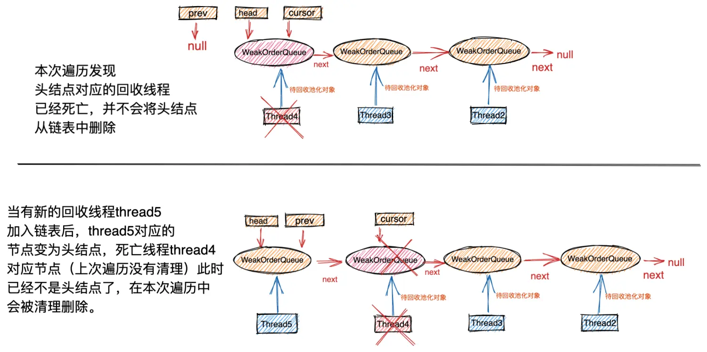​

WeakOrderQueue链表头结点的删除.png

首先当回收线程第一次开始帮助创建线程回收对象时，会将自己对应的WeakOrderQueue节点插入到创建线程对应Stack结构中的WeakOrderQueue链表的头结点位置。​**节点始终在链表的头结点位置插入**​。

如图所示，当本次遍历发现头结点对应的回收线程 thread4 已经挂掉后，清理完头结点中存储的待回收对象后，让其继续呆在链表中，​**并不着急将其删除**​。随后cursor指针指向thread3对应的节点，下一次遍历就会从thread3对应的节点开始遍历。

当有一个新的回收线程 thread5 加入后，此时thread5对应的WeakOrderQueue节点变成了链表中的头结点，当经过多次遍历之后，cursor指针最终会再次指向死亡线程`thread4`​对应的节点时，会再次进入`cursor.get() == null`​的处理逻辑，而此时`thread4`​对应的节点已经不是头结点了，所以在这次遍历中就将该节点从链表中删除。

> 这就是多线程并发代码和单线程代码设计上的不同，在多线程程序设计中，我们一定要时刻警惕同步操作的开销。能避免就要尽量避免。

**第二个问题：操作WeakOrderQueue链表的头结点为什么是同步方法呢？**

我们都知道一个回收线程对应一个WeakOrderQueue节点，当一个回收线程第一次为该创建线程回收对象时，都会新创建一个WeakOrderQueue节点并将节点插入到创建线程对应Stack中的WeakOrderQueue链表中的头结点位置。

在多线程回收场景下，可能会有多个回收线程同时向创建线程对应Stack中的WeakOrderQueue链表的头结点插入自己对应的节点。

那么此时对于链表头结点的操作就必须做同步处理了。当节点同步插入到链表的头结点后，以后该回收线程回收对象就是无锁化了。​**只不过就是在一开始插入节点的时候会有一点同步的开销，但是这是无法避免的**​。

```java
        //整个recycler对象池唯一的一个同步方法，而且同步块非常小，逻辑简单，执行迅速
        synchronized void setHead(WeakOrderQueue queue) {
            //始终在weakOrderQueue链表头结点插入新的节点
            queue.setNext(head);
            head = queue;
        }
```

纵观整个Recycler的设计实现，这个方法是唯一一个同步的方法，而且同步块非常的短，里面的逻辑非常简单。

> 在多线程程序设计中，如果遇到无法避免的同步情况，那么也必须使同步块内的代码逻辑尽量简单。
