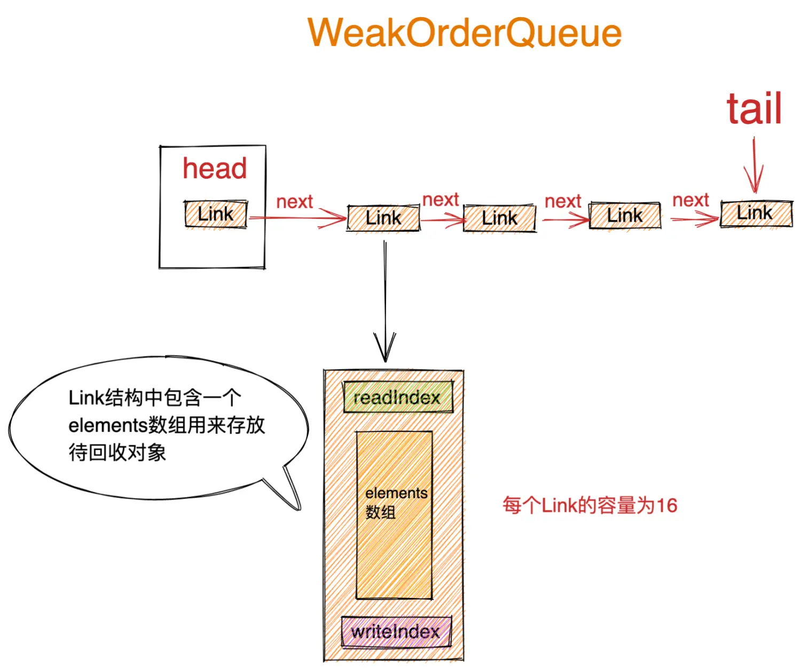
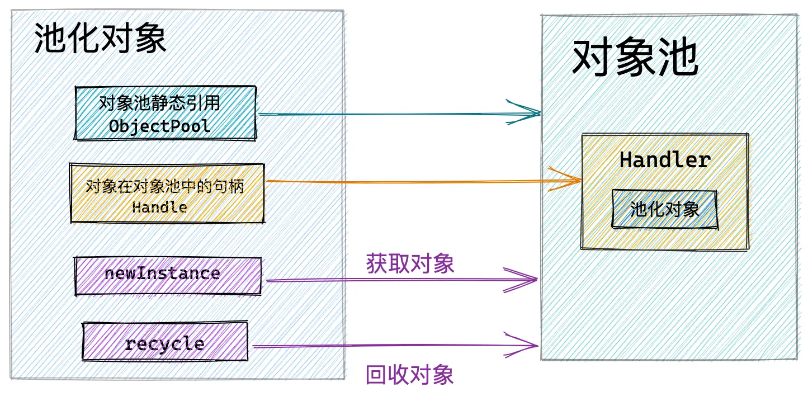
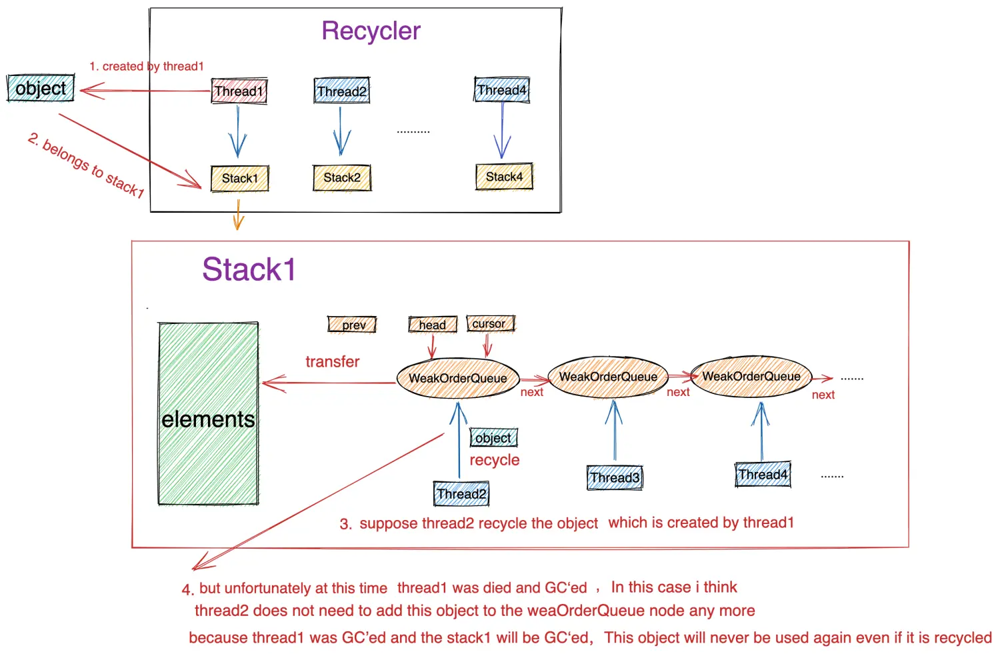
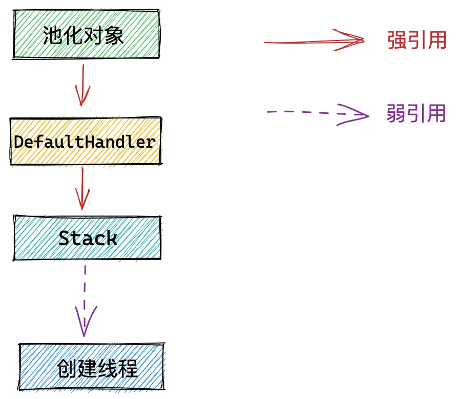
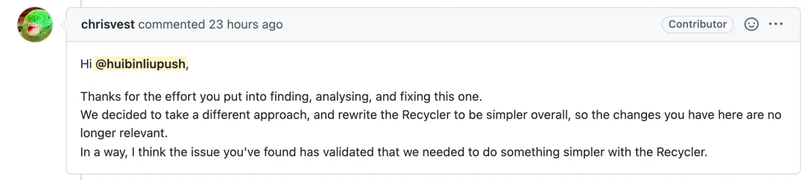
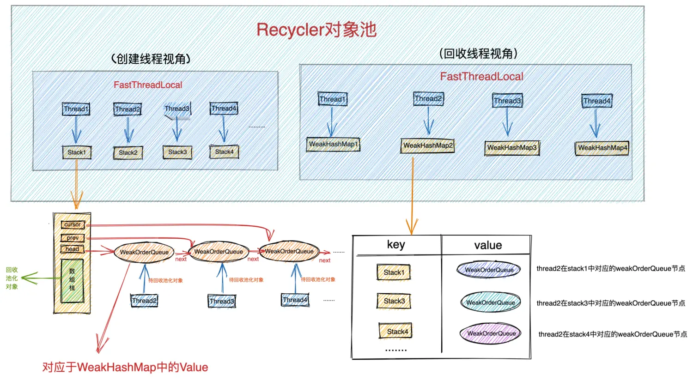
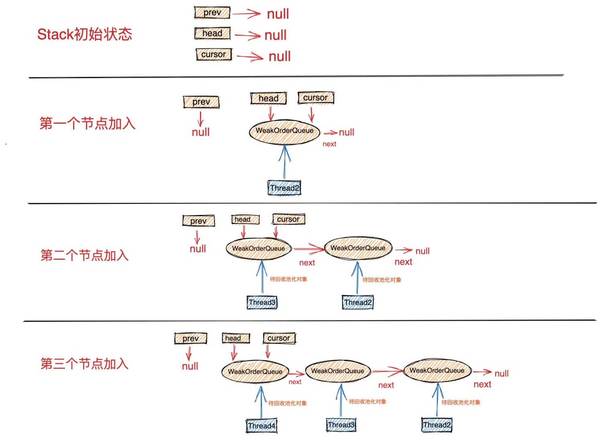

# 详解Recycler对象池的精妙设计与实现（下）

## 10. WeakOrderQueue的设计实现

​​

WeakOrderQueue.png

之前我们在介绍WeakOrderQueue结构设计原理的时候讲到，虽然该结构命名的后缀是一个Queue，但其实是一个链表，链表中的元素类型为Link，头结点指针Head永远指向第一个未被转移完毕的Link，当一个Link里的待回收对象被全部转移完毕后，head指针随即指向下一个节点，但是该Link节点并不会从链表中删除。尾指针Tail指向链表中最后一个`Link节点`​。节点的插入是从链表的尾部开始插入。

### 10.1 Link结构

```java
    private static final class WeakOrderQueue extends WeakReference<Thread> {

        // link结构是用于真正存储待回收对象的结构，继承AtomicInteger 本身可以用来当做writeindex使用
        static final class Link extends AtomicInteger {
            //数组用来存储待回收对象，容量为16
            final DefaultHandle<?>[] elements = new DefaultHandle[LINK_CAPACITY];

            int readIndex;
            //weakOrderQueue中的存储结构时由link结构节点元素组成的链表结构
            Link next;
        }
}
```

首先我们从WeakOrderQueue的继承结构上来看，它继承于 `WeakReference < Thread >`​ , 表示该结构持有一个线程的`弱引用`​，一个回收线程对应于一个WeakOrderQueue节点，很明显是持有其对应回收线程的弱引用，方便当回收线程挂掉的时候被GC回收。

* ​`DefaultHandle<?>[] elements`​: Link结构中包含一个容量为LINK_CAPACITY ，默认为16大小的DefaultHandle数组，用来存储回收线程回收的对象。
* ​`int readIndex`​：创建线程在转移Link节点中的待回收对象时，通过这个readIndex来读取未被转移的对象。由于readIndex只会被创建线程使用，所以这里并不需要保证原子性和可见性。用一个普通的int变量存储就好。
* ​`writeIndex`​：Link结构继承于AtomicInteger类型，这就意味着Link结构本身就可以被当做一个writeIndex来使用，由于回收线程在向Link节点添加回收对象的时候需要修改writeIndex，于此同时创建线程在转移Link节点的时候需要读取writeIndex，所以writeIndex需要保证线程安全性，故采用AtomicInteger类型存储。
* ​`Link next`​：Link节点的next指针，用于指向链表中的下一个节点。

### 10.2 Head结构

```java
        // weakOrderQueue内部link链表的头结点
        private static final class Head {
            //所有回收线程能够帮助创建线程回收对象的总容量 reserveSpaceForLink方法中会多线程操作该字段
            //用于指示当前回收线程是否继续为创建线程回收对象，所有回收线程都可以看到，这个值是所有回收线程共享的。以便可以保证所有回收线程回收的对象总量不能超过availableSharedCapacity
            private final AtomicInteger availableSharedCapacity;
            //link链表的头结点
            Link link;

            Head(AtomicInteger availableSharedCapacity) {
                this.availableSharedCapacity = availableSharedCapacity;
            }

            void reclaimAllSpaceAndUnlink() {
                    ....回收head节点的所有空间，并从链表中删除head节点，head指针指向下一节点....
            }

            private void reclaimSpace(int space) {
                //所有回收线程都可以看到，这个值是所有回收线程共享的。以便可以保证所有回收线程回收的对象总量不能超过availableSharedCapacity
                availableSharedCapacity.addAndGet(space);
            }

            //参数link为新的head节点，当前head指针指向的节点已经被回收完毕
            void relink(Link link) {
                  ...回收当前头结点的容量，更新head节点为指定的Link节点...
            }

            Link newLink() {
                  ....创建新的Link节点...
            }

            //此处目的是为接下来要创建的link预留空间容量
            static boolean reserveSpaceForLink(AtomicInteger availableSharedCapacity) {             
                  ...在创建新的Link节点之前需要调用该方法预订容量空间...
            }
        }
```

从代码结构上我们可以看出，Head结构的设计不只是作为头结点指针那么简单，其中还封装了很多链表操作以及回收的逻辑。

* ​`AtomicInteger availableSharedCapacity`​：这个字段前边已经介绍过多次了，它是多线程共享的一个字段，可以被多个回收线程进行操作，表达的语义是所有回收线程总共可以帮助创建线程一共可以回收多少对象。对所有回收线程回收对象的总量进行限制。每创建一个Link节点，它的值就减少一个LINK_CAPACITY ，每释放一个Link节点，它的值就增加一个LINK_CAPACITY 。
* ​`Link link`​：Head结构封装的Link链表中的头结点。

剩下Head结构中封装的相关逻辑处理方法，等到介绍到具体应用场景的时候，笔者在拿出来为大家介绍，这里先混个眼熟就行。先看懂个大概，脑海里朦朦胧胧有个粗浅的认识即可。

### 10.3 WeakOrderQueue中的重要属性

```java
 private static final class WeakOrderQueue extends WeakReference<Thread> {

        //link链表的头结点，head指针始终指向第一个未被转移完毕的LinK节点
        private final Head head;
        //尾结点
        private Link tail;
        //站在stack的视角中，stack中包含一个weakOrderQueue的链表，每个回收线程为当前stack回收的对象存放在回收线程对应的weakOrderQueue中
        //这样通过stack中的这个weakOrderQueue链表，就可以找到其他线程为该创建线程回收的对象
        private WeakOrderQueue next;
        //回收线程回收Id,每个weakOrderQueue分配一个，同一个stack下的一个回收线程对应一个weakOrderQueue节点
        private final int id = ID_GENERATOR.getAndIncrement();
        //回收线程回收比例 默认是8
        private final int interval;
        //回收线程回收计数 回收1/8的对象
        private int handleRecycleCount;

}
```

* ​`Head head`​：用于指向WeakOrderQueue中Link链表的头结点。
* ​`Link tail`​：指向Link链表中的尾结点。
* ​`WeakOrderQueue next`​：站在Stack结构的视角上，Stack包含一个WeakOrderQueue链表，用来存放回收线程回收过来的池化对象。该字段为WeakOrderQueue节点的next指针，用于指向下一个回收线程对应的WeakOrderQueue节点。
* ​`int id`​：对应回收线程的回收Id，同一个Stack结构下，不同的回收线程对应不同的Id。
* ​`int interval`​：回收线程对应的回收频率，默认只回收 1 / 8 的池化对象。
* ​`int handleRecycleCount`​：回收对象计数，前边我们多次讲过了。用于控制回收频率。

### 10.4 WeakOrderQueue结构的创建

```java
private static final class WeakOrderQueue extends WeakReference<Thread> {
        //为了使stack能够被GC,这里不会持有其所属stack的引用
        private WeakOrderQueue(Stack<?> stack, Thread thread) {
            //weakOrderQueue持有对应回收线程的弱引用
            super(thread);
            //创建尾结点
            tail = new Link();

            // 创建头结点  availableSharedCapacity = maxCapacity / maxSharedCapacityFactor
            head = new Head(stack.availableSharedCapacity);
            head.link = tail;
            interval = stack.delayedQueueInterval;
            handleRecycleCount = interval; 
        }
}
```

在创建WeakOrderQueue结构的时候，首先会调用父类 `WeakReference<Thread>`​ 的构造方法持有当前回收线程的弱应用。

然后创建第一个Link节点，head指针和tail指针同时指向这第一个节点。

用创建线程对应的Stack中的属性初始化WeakOrderQueue结构中的相关属性。

大家这里可能会问了，既然这里用Stack中的属性去初始化WeakOrderQueue结构中的相关属性，那​**为什么WeakOrderQueue不直接持有Stack的引用呢**​？

之前我们提到，一个回收线程对应一个WeakOrderQueue节点，当回收线程挂掉的时候，需要清理WeakOrderQueue节点并将其从Stack结构中的WeakOrderQueue链表（头结点除外）中删除。使得WeakOrderQueue节点可以被GC回收掉。

**如果Stack结构对应的创建线程挂掉，而此时WeakOrderQueue又持有了Stack的引用，这样就使得Stack结构无法被GC掉。**

所以这里只会用Stack结构的相关属性去初始化WeakOrderQueue结构，在WeakOrderQueue中并不会持有Stack的引用。

> 在复杂程序结构的设计中，我们要时刻对对象之间的引用关系保持清晰的认识。防止内存泄露。

### 10.5 从WeakOrderQueue中转移回收对象

WeakOrderQueue的transfer方法用于将当前WeakOrderQueue节点中的待回收对象转移至创建线程对应的Stack中。

开始转移回收对象时会从WeakOrderQueue节点中的Link链表的头结点开始遍历，如果头结点中还有未被转移的对象，则将头结点剩余的未转移对象转移至Stack中。所以创建线程每次最多转移一个LINK_CAPACITY大小的对象至Stack中。只要成功转移了哪怕一个对象，transfer方法就会返回true。

如果头结点中存储的对象已经全部转移完毕，则更新head指针指向下一个Link节点，开始转移下一个Link节点。​**创建线程每次只会转移一个Link节点**​。如果Link链表是空的，没有转移成功一个对象，则transfer方法返回false。

由于transfer方法体比较大，笔者将其按照上述逻辑步骤拆分开来为大家讲解：

​​

回收对象转移.png

#### 10.5.1 判断头结点中的待回收对象是否转移完毕

```java
            //获取当前weakOrderQueue节点中的link链表头结点
            Link head = this.head.link;
            //头结点为null说明还没有待回收对象
            if (head == null) {
                return false;
            }

            //如果头结点中的待回收对象已经被转移完毕
            if (head.readIndex == LINK_CAPACITY) {
                //判断是否有后续Link节点
                if (head.next == null) {
                    //整个link链表没有待回收对象了已经
                    return false;
                }
                head = head.next;
                //当前Head节点已经被转移完毕，head指针向后移动，head指针始终指向第一个未被转移完毕的LinK节点
                this.head.relink(head);
            }
```

首先从Link链表的头结点开始转移，`head == null`​ 说明当前Link链表是空的并没有对象可被转移，直接返回false。

​`head.readIndex == LINK_CAPACITY`​ 判断当前头结点中的对象是否已经被转移完毕，如果当前头结点中的对象已经被全部转移完毕，则将head指针更新 relink 为下一个节点，开始从下一个节点开始转移对象。如果此时Link链表已经为空了，直接返回false。

```java
 private static final class Head {

            //参数link为新的head节点，当前head指针指向的节点已经被回收完毕
            void relink(Link link) {
                //更新availableSharedCapacity，因为当前link节点中的待回收对象已经被转移完毕，所以需要增加availableSharedCapacity的值
                reclaimSpace(LINK_CAPACITY);
                //head指针指向新的头结点（第一个未被回收完毕的link节点）
                this.link = link;
            }
            private void reclaimSpace(int space) {
                //所有回收线程都可以看到，这个值是所有回收线程共享的。以便可以保证所有回收线程回收的对象总量不能超过availableSharedCapacity
                availableSharedCapacity.addAndGet(space);
            }
}
```

#### 10.5.2 根据本次转移对象容量评估是否应该对Stack进行扩容

此时Head节点已经校验完毕，可以执行正常的转移逻辑了。但在转移逻辑正式开始之前，还需要对本次转移对象的容量进行计算，并评估Stack的当前容量是否可以容纳的下，如果Stack的当前容量不够，则需要对Stack进行扩容。

```java
            final int srcStart = head.readIndex;
            //writeIndex
            int srcEnd = head.get();
            //该link节点可被转移的对象容量
            final int srcSize = srcEnd - srcStart;
            if (srcSize == 0) {
                return false;
            }

            // 获取创建线程stack中的当前回收对象数量总量
            final int dstSize = dst.size;
            // 待回收对象从weakOrderQueue中转移到stack后，stack的新容量 = 转移前stack容量 + 转移的待回收对象个数
            final int expectedCapacity = dstSize + srcSize;

            if (expectedCapacity > dst.elements.length) {
                //如果转移后的stack容量超过当前stack的容量 则对stack进行扩容
                final int actualCapacity = dst.increaseCapacity(expectedCapacity);
                //每次转移最多一个Link的容量
                //actualCapacity - dstSize表示扩容后的stack还有多少剩余空间
                srcEnd = min(srcStart + actualCapacity - dstSize, srcEnd);
            }
```

获取Link链表头结点的readIndex和writeIndex，通过  `writeIndex - readIndex`​ 计算出当前头结点有多少可被转移的对象。

Stack的最终容量为： `expectedCapacity = stack当前容量 + 转移对象的容量`​。

如果计算得出转移后Stack的最终容量 expectedCapacity 超过了Stack的当前容量则需要对Stack进行扩容。根据扩容后的容量最终决定本次转移多少对象： `min(srcStart + actualCapacity - dstSize, srcEnd)`​ ，确保不能超过Stack可容纳的空间。

```java
private static final class Stack<T> {

        int increaseCapacity(int expectedCapacity) {
            int newCapacity = elements.length;
            int maxCapacity = this.maxCapacity;
            do {
                newCapacity <<= 1;
            } while (newCapacity < expectedCapacity && newCapacity < maxCapacity);
            //扩容后的新容量为最接近指定容量expectedCapacity的最大2的次幂
            newCapacity = min(newCapacity, maxCapacity);
            if (newCapacity != elements.length) {
                elements = Arrays.copyOf(elements, newCapacity);
            }

            return newCapacity;
        }

}
```

如果当前Stack已经达到最大容量，无法再继续扩容：`actualCapacity - dstSize = 0`​，则停止本次转移操作，直接返回`false`​。

```java
if (srcStart != srcEnd) {
   .....具体的转移逻辑.......
}else {
    // The destination stack is full already.
    return false;
}
```

​**如果Stack的容量可以容纳头结点中存储的待转移对象，则开始正式的转移逻辑**​：

#### 10.5.3 转移回收对象

```java
                //待转移对象集合 也就是Link节点中存储的元素
                final DefaultHandle[] srcElems = head.elements;
                //stack中存储转移对象数组
                final DefaultHandle[] dstElems = dst.elements;
                int newDstSize = dstSize;
                for (int i = srcStart; i < srcEnd; i++) {
                    DefaultHandle<?> element = srcElems[i];
                    //recycleId == 0 表示对象还没有被真正的回收到stack中
                    if (element.recycleId == 0) {
                        //设置recycleId 表明是被哪个weakOrderQueue回收的
                        element.recycleId = element.lastRecycledId;
                    } else if (element.recycleId != element.lastRecycledId) {
                        //既被创建线程回收 同时也被回收线程回收  回收多次 则停止转移
                        throw new IllegalStateException("recycled already");
                    }
                    //对象转移后需要置空Link节点对应的位置
                    srcElems[i] = null;

                    //这里从weakOrderQueue将待回收对象真正回收到所属stack之前 需要进行回收频率控制
                    if (dst.dropHandle(element)) {
                        // Drop the object.
                        continue;
                    }
                    //重新为defaultHandler设置其所属stack(初始创建该handler的线程对应的stack)
                    //该defaultHandler在被回收对象回收的时候，会将其stack置为null，防止极端情况下，创建线程挂掉，对应stack无法被GC
                    element.stack = dst;
                    //此刻，handler才真正的被回收到所属stack中
                    dstElems[newDstSize ++] = element;
                }
```

将当前Link节点中的elements数组里存储的对象转移至Stack中的数组栈elements中。转移范围 `srcStart -> srcEnd`​。

如果当前转移对象 `element.recycleId == 0`​ 说明当前对象还没有被真正的回收至创建线程对应的Stack中，符合转移条件（不能被多次回收）。还记不记得我们前边在《9.3 从Stack中获取池化对象》小节介绍的：

* ​`recycleId = lastRecycledId = 0`​：表示池化对象刚刚被创建或者刚刚从对象池中取出即将被再次复用。这是池化对象的初始状态。

随后设置回收Id `element.recycleId = element.lastRecycledId`​。此处的lastRecycledId为当前WeakOrderQueue节点对应的回收线程Id。

​`element.recycleId != element.lastRecycledId`​ 此处表示当前对象可能被创建线程回收了，也可能被回收线程回收了。

如果当前转移对象已经被回收至Stack中，则不能被再次回收，停止转移。

#### 10.5.4 控制对象回收频率

符合转移条件的对象，需要再次经过回收频率的控制，即前边介绍的只回收 1 / 8 的对象，也就是每 8 个对象回收 1 个。

```java
        boolean dropHandle(DefaultHandle<?> handle) {
            if (!handle.hasBeenRecycled) {
                //回收计数handleRecycleCount 初始值为8 这样可以保证创建的第一个对象可以被池化回收
                //interval控制回收频率 8个对象回收一个
                if (handleRecycleCount < interval) {
                    handleRecycleCount++;
                    // Drop the object.
                    return true;
                }
                //回收一个对象后，回收计数清零
                handleRecycleCount = 0;
                //设置defaultHandler的回收标识为true
                handle.hasBeenRecycled = true;
            }
            return false;
        }
```

当对象通过了回收频率的验证之后，最后将回收对象的DefaultHandler中持有的Stack引用再次设置为其创建线程对应的Stack。因为在回收线程将池化对象回收至WeakOrderQueue节点时，会将其DefaultHandler中对Stack的引用置为null。所以这里需要重置回来。

> 具体为什么在回收线程回收时会将回收对象的Stack引用置为null，大家这里可以自己先思考下，等到后面我们讲解多线程回收时，笔者在为大家揭开谜底。

随后会将对象压入Stack结构中的数组栈中，到这里，回收线程帮助创建线程回收的对象才算真正的被回收了，业务线程可以直接从对象池中取出使用了。

当对象转移完毕后，更新当前Link节点的readIndex，更新Stack中数组栈的栈顶指针。如果当前Link节点已经被转移完毕，则Head指针指向链表中的下一个节点，开始等待下一次的转移。

```java
             if (srcEnd == LINK_CAPACITY && head.next != null) {
                    // Add capacity back as the Link is GCed.
                    // 如果当前Link已经被回收完毕，且link链表还有后续节点，则更新head指针
                    this.head.relink(head.next);
                }

                //更新当前回收Link的readIndex
                head.readIndex = srcEnd;
                //如果没有转移任何数据 return false
                if (dst.size == newDstSize) {
                    return false;
                }
                dst.size = newDstSize;
                return true;
```

到现在为止，多线程从Recycler对象池中无锁化获取对象的完整流程，笔者就为大家介绍完了，下面我们来继续剖析下多线程回收对象的场景。

## 11. 多线程回收对象无锁化实现

之前我们在介绍池化对象的设计时，提到业务线程在使用对象的时候不应该感受到对象池的存在，所以将池化对象的回收，封装在其DefaultHandler中。在业务线程使用完对象时，直接调用池化对象的recycle方法进行回收即可。

​​

池化对象结构.png

```java
static final class Entry {

       private  Handle<Entry> handle;

       void recycle() {
            next = null;
            bufs = null;
            buf = null;
            msg = null;
            promise = null;
            progress = 0;
            total = 0;
            pendingSize = 0;
            count = -1;
            cancelled = false;
            handle.recycle(this);
        }

}
```

```java
private static final class DefaultHandle<T> implements Handle<T> {
      
        ..................省略............

        //强引用关联创建handler的stack
        Stack<?> stack;
        //池化对象
        Object value;

        @Override
        public void recycle(Object object) {
            if (object != value) {
                throw new IllegalArgumentException("object does not belong to handle");
            }

            Stack<?> stack = this.stack;
            //handler初次创建以及从对象池中获取到时  recycleId = lastRecycledId = 0（对象被回收之前）
            //创建线程回收对象后recycleId = lastRecycledId = OWN_THREAD_ID
            //回收线程回收对象后lastRecycledId = 回收线程Id,当对象被转移到stack中后 recycleId = lastRecycledId = 回收线程Id
            if (lastRecycledId != recycleId || stack == null) {
                throw new IllegalStateException("recycled already");
            }

            stack.push(this);
        }

}
```

DefaultHandler中的 recycle 方法逻辑比较简单，唯一不好理解的地方在于判断对象是否已经被回收的 if 条件语句。

* ​`lastRecycledId != recycleId`​ ：此时对象的状态正处于已经被回收线程回收至对应 WeakOrderQueue 节点的半回收状态，但还未被转移至其创建线程对应的Stack中。​**所以这个条件要控制的事情就是如果对象已经被回收线程回收，那么就停止本次的回收操作**​。

> 忘记的同学可以在回看下《9.3 从Stack中获取池化对象》小节，那里详细介绍了 recycleId 和 lastRecycledId 之间各种关系的变化及其含义

* ​`stack == null`​ ：这种情况其实前边我们也有提到过，就是当池化对象对应的创建线程挂掉的时候，对应的Stack随后也被GC回收掉。那么这时就不需要在回收该池化对象了。

### 11.1 回收对象至Stack中——啊哈！Bug!

```java
private static final class Stack<T> {
        //持有对应创建线程的弱引用
        final WeakReference<Thread> threadRef;

        void push(DefaultHandle<?> item) {
            Thread currentThread = Thread.currentThread();
            //判断当前线程是否为创建线程  对象池的回收原则是谁创建，最终由谁回收。其他线程只是将回收对象放入weakOrderQueue中
            //最终是要回收到创建线程对应的stack中的
            if (threadRef.get() == currentThread) {
                // 如果当前线程正是创建对象的线程，则直接进行回收 直接放入与创建线程关联的stack中
                pushNow(item);
            } else {
                // 当前线程不是创建线程，则将回收对象放入创建线程对应的stack中的weakOrderQueue链表相应节点中（currentThread对应的节点）
                pushLater(item, currentThread);
            }
        }
}
```

这里会进入到池化对象DefaultHandler中持有的Stack中，在Stack中进行对象的回收。

> 大家这里先不要看笔者下面的解释，试着自己着重分析下这个 if...else...逻辑判断，有没有发现什么问题？？Bug就在这里！！

这里首先会判断当前回收线程是否为池化对象的创建线程：`threadRef.get() == currentThread)`​。如果是，则由创建线程直接回收 pushNow(item) 。

如果 `threadRef.get() != currentThread)`​ 这里有两种情况：

1. currentThread是回收线程，那么就按多线程回收的逻辑 `pushLater(item, currentThread)`​ ，由回收线程将对象回收至其对应的WeakOrderQueue节点中，这里没什么毛病。
2. Bug就出现在第二种情况，还有一种情况是 `threadRef.get() == null`​ 也会走到 else 分支里。表示该回收对象的创建线程已经挂掉，并被GC回收。​**那么在这种情况下已经没有必要在对该对象进行回收了**​，因为创建线程已经挂掉，随后对应的Stack也迟早被GC掉，​**这个对象即使被回收进Stack也永远不会在被使用到**​。但是Netty的做法还是会让回收线程将其回收至Stack中的WeakOrderQueue链表中，笔者认为这里根本就没必要在添加至WeakOrderQueue链表中了。

Bug产生的场景如下如所示：

​​

‍

​**在第二种情况下，Netty还有一个重要的场景没有考虑到，会导致内存泄露**​！！

什么场景呢？大家再来回顾下池化对象与对象池之间的引用关系图：

​​

‍

这里我们看到池化对象会引用DefaultHandler，而DefaultHandler又强引用了Stack。于是就形成了这样一条引用链：

​​

‍

而池化对象是对外暴露的，用户可能在某个地方一直引用着这个池化对象，如果创建线程挂掉，并被GC回收之后，那么其在对象池中对应的Stack也应该被回收，因为Stack里保存的回收对象将再也不会被用到了。但是因为这条引用链的存在，导致Stack无法被GC回收从而造成内存泄露！

## 11.2 笔者反手一个PR，修复这个Bug!

现在Bug产生的原因和造成的影响，笔者为大家已经分析清楚了，那么接下来的解决方案就变得很简单了。

笔者先向Netty社区提了一个 Issue11864 来说明这个问题。

> Issue11864 : [https://github.com/netty/netty/issues/11864](https://links.jianshu.com/go?to=https%3A%2F%2Fgithub.com%2Fnetty%2Fnetty%2Fissues%2F11864)

然后直接提了 PR11865 来修复这个Bug。

> PR : [https://github.com/netty/netty/pull/11865](https://links.jianshu.com/go?to=https%3A%2F%2Fgithub.com%2Fnetty%2Fnetty%2Fpull%2F11865)

PR中主要的修改点分为以下两点：

1. 笔者在修复方案中觉得在这里应该尽早处理掉 `threadRef.get() == null`​ 的情况，因为创建线程已经死掉，此时在为创建线程回收对象已经没有任何意义了，这种情况直接 return 掉就好。
2. 由于池化对象强引用到了其创建线程对应的Stack，当创建线程挂掉之后，我们需要解除这个引用链 `item.stack = null`​，保证Stack最终可以被GC回收。

以下代码为笔者提交的PR中的修复方案，主要增加了对 `threadRef.get() == null`​ 情况的处理，并添加了详细注释。

```java
        void push(DefaultHandle<?> item) {
            Thread currentThread = Thread.currentThread();
            if (threadRef.get() == currentThread) {
                pushNow(item);
            } else if (threadRef.get() == null) {
                // when the thread that belonged to the Stack was died or GC'ed，
                // There is no need to add this item to WeakOrderQueue-linked-list which belonged to the Stack any more
                item.stack = null;
            } else {
                pushLater(item, currentThread);
            }
        }
```

## 11.3 PR的后续

当笔者提交了 PR11865之后，得到了相关作者如下回复。

​​

image.png

巧合的是Netty也意识到了对象池这块的问题，Netty最近也正在重构 Recycler 这一块，因为Recycler整体设计的还是比较复杂的，这从我们这篇源码解析的文章中也可以看的出来，Recycler的复杂性在于它的使用场景混合了**并发**以及与​**GC相关的交互**​，这些相关的问题都比较难以定位，所以Netty决定将对象池这一块用一种更加容易被理解的方式重构掉。

相关的重构内容大家可以看作者的这个commit。

> 重构commit：[https://github.com/netty/netty/commit/28b9834612638ffec4948c0c650d04f766f20690](https://links.jianshu.com/go?to=https%3A%2F%2Fgithub.com%2Fnetty%2Fnetty%2Fcommit%2F28b9834612638ffec4948c0c650d04f766f20690)

重构后的Recycler对象池在**4.1.71.Final**版本已经发布。笔者后续也会为大家安排一篇重构后的Recycler对象池源码解析，但是本文还是聚焦于**4.1.71.Final**之前版本的对象池介绍，虽然被重构了，但是这里也有很多的设计思想和多线程程序设计细节非常值得我们学习！

在**4.1.71.Final**版本发布之后，笔者想的是后面抽空看下重构后的对象池实现，哈哈，只要谓语动词出现—— ”想的是.....“ 类似这样的句式，估计就没有以后了，哈哈。笔者还是大意了，这个 Issue11864 : [https://github.com/netty/netty/issues/11864](https://links.jianshu.com/go?to=https%3A%2F%2Fgithub.com%2Fnetty%2Fnetty%2Fissues%2F11864) 在过了几个月之后在社区里又被讨论了起来。有人发现在**4.1.71.Final**对象池重构后的版本中笔者提到的这些问题还是存在的。

于是作者 chrisvest 又 提了一个 PR11996 最终在 **4.1.74.Final**版本中修复了笔者提的这个 Issue11864。

> PR11996 ：[https://github.com/netty/netty/pull/11996](https://links.jianshu.com/go?to=https%3A%2F%2Fgithub.com%2Fnetty%2Fnetty%2Fpull%2F11996)

> 随口提一句，这个大牛 chrisvest 是大名鼎鼎的图数据库 Neo4j 的核心commitor，同时也是Netty Buffer相关API的设计者。

这里笔者将这个Bug在 **4.1.74.Final** 版本中的最终修复方案和大家说明一下，收个尾。

1. 首先 chrisvest 大牛 认为 当创建线程挂掉的时候，我们可以在threadLocal的  
    onRemoval方法中将创建线程对应的LocalPool里边用于存放回收对象的pooledHandles 直接置为 null。这里的语义是标记LocalPool已经死掉了，不会再继续使用。

> 在重构后的版本中引入了 LocalPool 来代替我们前边介绍的Stack。LocalPool中的pooledHandles大家可以简单认为类似Stack中数组栈的功能。

```java
public abstract class Recycler<T> {

    private final FastThreadLocal<LocalPool<T>> threadLocal = new FastThreadLocal<LocalPool<T>>() {
        @Override
        protected LocalPool<T> initialValue() {
            return new LocalPool<T>(maxCapacityPerThread, interval, chunkSize);
        }

        @Override
        protected void onRemoval(LocalPool<T> value) throws Exception {
            //删除LocalPool
            super.onRemoval(value);
            MessagePassingQueue<DefaultHandle<T>> handles = value.pooledHandles;
            //pooledHandles 置为 null，取消引用
            value.pooledHandles = null;
            //清除LocalPool中保存的回收对象
            handles.clear();
        }
    };

}
```

2. 在多线程回收对象的时候，会首先判断该回收对象对应的LocalPool里的pooledHandles是否已经被清理变为不可用状态。如果是的话就停止回收。

```java
private static final class LocalPool<T> {
    //保证可见性
    private volatile MessagePassingQueue<DefaultHandle<T>> pooledHandles;

     void release(DefaultHandle<T> handle) {
            MessagePassingQueue<DefaultHandle<T>> handles = pooledHandles;
            handle.toAvailable();
            if (handles != null) {
                handles.relaxedOffer(handle);
            }
        }
}
```

通过以上两个措施 就保证了 当创建线程被GC掉之后，它对应的 在对象池中的回收缓存LocalPool（类比Stack）不会出现内存泄露，同时保证了多线程不在将回收对象至已经被清理的LocalPool中。

好了，这一块的Bug修改我们介绍完了，我们继续多线程回收对象主流程的介绍：

### 11.4 创建线程直接回收对象

```java
       private void pushNow(DefaultHandle<?> item) {
            //池化对象被回收前 recycleId = lastRecycleId = 0
            //如果其中之一不为0 说明已经被回收了
            if ((item.recycleId | item.lastRecycledId) != 0) {
                throw new IllegalStateException("recycled already");
            }

            //此处是由创建线程回收，则将池化对象的recycleId与lastRecycleId设置为创建线程Id-OWN_THREAD_ID
            //注意这里的OWN_THREAD_ID是一个固定的值，是因为这里的视角是池化对象的视角，只需要区分创建线程和非创建线程即可。
            //对于一个池化对象来说创建线程只有一个 所以用一个固定的OWN_THREAD_ID来表示创建线程Id
            item.recycleId = item.lastRecycledId = OWN_THREAD_ID;

            int size = this.size;
            //如果当前池化对象的容量已经超过最大容量 则丢弃对象
            //为了避免池化对象的急速膨胀，这里只会回收1/8的对象，剩下的对象都需要丢弃
            if (size >= maxCapacity || dropHandle(item)) {
                // Hit the maximum capacity or should drop - drop the possibly youngest object.
                //丢弃对象
                return;
            }

            //当前线程对应的stack容量已满但是还没超过最大容量限制，则对stack进行扩容
            if (size == elements.length) {
                //容量扩大两倍
                elements = Arrays.copyOf(elements, min(size << 1, maxCapacity));
            }
            //将对象回收至当前stack中
            elements[size] = item;
            //更新当前stack的栈顶指针
            this.size = size + 1;
        }
```

* 首先需要判断该回收对象是否已经被回收了。`item.recycleId | item.lastRecycledId) != 0`​，这里任意Id只要不为0，说明该对象已经对回收了，则停止本次回收操作。
* 当对象被创建线程回收时，设置回收Id：`item.recycleId = item.lastRecycledId = OWN_THREAD_ID`​。
* 如果当前Stack已经达到最大容量则将对象丢弃。
* 为了避免对象池不可控制的迅速膨胀，这里只会回收 1 / 8 的对象，剩下的对象都需要丢弃 dropHandle 。
* 如果当前Stack容量已满但是还没超过最大容量限制，则对stack进行扩容。一次性扩容两倍但不能超过最大容量。
* 最后将对象压入Stack结构中的数组栈中，完成对象的回收。

### 11.5 回收线程间接回收对象

​​

Recycler对象池.png

在Recycler对象池中，一个线程既可以是创建线程也可以是回收线程。

比如上图中的 thread2 , thread3 , thread4 ...  这里的每一个线程既可以在对象池中创建对象，并将对象回收至自己对应的Stack结构里的数组栈中，此刻它们的角色为创建线程。比如图中的thread1。

同时其他线程 比如图中的 thread2 , thread3 , thread4 ... 也可以为thread1回收由thread1创建的对象，将这些对象回收至thread1对应的Stack结构里的WeakOrderQueue链表中。此刻 thread2 , thread3 , thread4 ...  为回收线程。

在之前介绍Recycler对象池的重要属性时，我们提到过 maxDelayedQueuesPerThread 属性。

```java
public abstract class Recycler<T> {

      //每个回收线程最多可以帮助多少个创建线程回收对象 默认：cpu核数 * 2
      private static final int MAX_DELAYED_QUEUES_PER_THREAD;

     //一个回收线程可帮助多少个创建线程回收对象
      private final int maxDelayedQueuesPerThread;

      private static final class Stack<T> {

            // 当前线程可以帮助多少个线程回收其池化对象
            private final int maxDelayedQueues;

      }

}

```

在Recycler对象池中，一个回收线程能够帮助多少个创建线程回收对象是有限制的，通过 maxDelayedQueuesPerThread属性 控制。

​**那么在对象池中，一个回收线程如何存储为其他创建线程回收到的对象呢**​？

​​

Recycler对象池整体架构.png

如图中所示，我们站在回收线程的视角来看，在对象池中有一个 FastThreadLocal 类型的 DELAYED_RECYCLED 字段， DELAYED_RECYCLED 为每个回收线程保存了一个 WeakHashMap，正是这个回收线程持有的 WeakHashMap 结构中保存了该回收线程为每个创建线程回收的对象。

WeakHashMap 结构中的 key 表示创建线程对应的 Stack 结构。意思是该回收线程为哪个创建线程回收对象。value 表示这个回收线程在创建线程中对应Stack结构里的WeakOrderQueue链表中对应的节点。大家在结合 《Recycler对象池.png》 这副图仔细体会下这个结构设计。

```java
public abstract class Recycler<T> {

    //实现跨线程回收的核心，这里保存的是当前线程为其他线程回收的对象（由其他线程创建的池化对象）
    //key: 池化对象对应的创建线程stack  value: 当前线程代替该创建线程回收的池化对象 存放在weakOrderQueue中
    //这里的value即是 创建线程对应stack中的weakOrderQueue链表中的节点（每个节点表示其他线程为当前创建线程回收的对象）
    private static final FastThreadLocal<Map<Stack<?>, WeakOrderQueue>> DELAYED_RECYCLED =
            new FastThreadLocal<Map<Stack<?>, WeakOrderQueue>>() {
        @Override
        protected Map<Stack<?>, WeakOrderQueue> initialValue() {
            return new WeakHashMap<Stack<?>, WeakOrderQueue>();
        }
    };

}
```

而这个WeakHashMap 的size即表示当前回收线程已经在为多少个创建线程回收对象了，size的值不能超过 maxDelayedQueuesPerThread 。

​**这里为什么要用WeakHashMap呢**​?

其实我们前边多少也提到过了，考虑到一种极端的情况就是当创建线程挂掉并且被GC回收之后，其实这个创建线程对应的Stack结构已经没有用了，存储在Stack结构中的池化对象永远不会再被使用到，此时回收线程完全就没有必要在为挂掉的创建线程回收对象了。而这个Stack结构如果没有任何引用链存在的话，随后也会被GC回收。那么这个Stack结构在WeakHashMap中对应的Entry也会被自动删除。如果这里不采用WeakHashMap，那么回收线程为该Stack回收的对象就会一直停留在回收线程中。

介绍完这些背景知识，下面我们就来正式介绍下回收线程到底是如何帮助创建线程回收对象的：

```java
      private void pushLater(DefaultHandle<?> item, Thread thread) {
            //maxDelayQueues == 0 表示不支持对象的跨线程回收
            if (maxDelayedQueues == 0) {
                //直接丢弃
                return;
            }
          
            //注意这里的视角切换，当前线程为回收线程
            Map<Stack<?>, WeakOrderQueue> delayedRecycled = DELAYED_RECYCLED.get();
            //获取当前回收对象属于的stack 由当前线程帮助其回收  注意这里是跨线程回收 当前线程并不是创建线程
            WeakOrderQueue queue = delayedRecycled.get(this);
            //queue == null 表示当前线程是第一次为该stack回收对象
            if (queue == null) {
                //maxDelayedQueues指示一个线程最多可以帮助多少个线程回收其创建的对象
                //delayedRecycled.size()表示当前线程已经帮助多少个线程回收对象
                if (delayedRecycled.size() >= maxDelayedQueues) {
              
                    //如果超过指定帮助线程个数，则停止为其创建WeakOrderQueue，停止为其回收对象
                    //WeakOrderQueue.DUMMY这里是一个标识，后边遇到这个标识  就不会为其回收对象了
                    delayedRecycled.put(this, WeakOrderQueue.DUMMY);
                    return;
                }
 
                // 创建为回收线程对应的WeakOrderQueue节点以便保存当前线程为其回收的对象
                if ((queue = newWeakOrderQueue(thread)) == null) {
                    // 创建失败则丢弃对象
                    return;
                }
                //在当前线程的threadLocal中建立 回收对象对应的stack 与 weakOrderQueue的对应关系
                delayedRecycled.put(this, queue);
            } else if (queue == WeakOrderQueue.DUMMY) {
                // drop object
                // 如果queue的值是WeakOrderQueue.DUMMY 表示当前已经超过了允许帮助的线程数 直接丢弃对象
                return;
            }

            //当前线程为对象的创建线程回收对象  放入对应的weakOrderQueue中
            queue.add(item);
        }
```

1. 首先需要判断当前Recycler对象池是否支持跨线程回收。 `maxDelayedQueues == 0`​ 表示不支持对象的跨线程回收。
2. 如果当前回收线程是第一次为该回收对象的创建线程进行回收，则需要为当前回收线程在对象的创建线程对应Stack结构中创建对应的WeakOrderQueue节点。（​**这里正是多线程无锁化回收对象的核心所在**​）。当然创建之前需要判断是否超过了可帮助创建线程的个数 maxDelayedQueues 。
3. 如果当前回收线程帮助的创建线程个数已经超过了 maxDelayedQueues 限制，则向对应的 WeakHashMap 塞入一个空的 WeakOrderQueue节点 DUMMY，后续如果遇到 WeakOrderQueue 节点是 DUMMY 实例则丢弃对象，放弃回收。

```java
 private static final class WeakOrderQueue extends WeakReference<Thread> {
        //作为一个标识，遇到DUMMY实例，则直接丢弃回收对象
        static final WeakOrderQueue DUMMY = new WeakOrderQueue();

}
```

4. 如果当前回收线程帮助的创建线程个数还没有超过 maxDelayedQueues 限制，则通过 `stack#newWeakOrderQueue`​ 为当前回收线程在回收对象对应Stack结构中创建相应的WeakOrderQueue节点。并在回收线程持有的WeakHashMap中建立Stack与回收线程对应的WeakOrderQueue节点的关联关系。
5. 最终由回收线程将对象回收至其创建线程对应的Stack结构中。（将回收对象添加至回收线程对应的WeakOrderQueue节点中，完成多线程无锁化回收）

### 11.6  为回收线程创建对应的WeakOrderQueue节点

上小节提到，当回收线程第一次为创建线程回收对象的时候，需要在创建线程对应Stack结构中的WeakOrderQueue链表中创建与回收线程对应的WeakOrderQueue节点。

```java
   private static final class Stack<T> {

         private WeakOrderQueue newWeakOrderQueue(Thread thread) {
              return WeakOrderQueue.newQueue(this, thread);
        }
   }
```

​​

WeakOrderQueue.png

```java
private static final class WeakOrderQueue extends WeakReference<Thread> {

        static WeakOrderQueue newQueue(Stack<?> stack, Thread thread) {
  
            // link是weakOrderQueue中存储回收对象的最小结构，此处是为接下来要创建的Link预订空间容量
            // 如果stack指定的availableSharedCapacity 小于 LINK_CAPACITY大小，则分配失败
            if (!Head.reserveSpaceForLink(stack.availableSharedCapacity)) {
                return null;
            }

            //如果还够容量来分配一个link那么就创建weakOrderQueue
            final WeakOrderQueue queue = new WeakOrderQueue(stack, thread);

            // 向stack中的weakOrderQueue链表中添加当前回收线程对应的weakOrderQueue节点（始终在头结点处添加节点 ）
            // 此处向stack中添加weakOrderQueue节点的操作被移到WeakOrderQueue构造器之外的目的是防止WeakOrderQueue.this指针
            // 逃逸避免被其他线程在其构造的过程中访问
            stack.setHead(queue);

            return queue;
        }

}
```

在前边介绍WeakOrderQueue的结构的时候，我们提到WeakOrderQueue结构内部其实一个由Link节点组成的链表。WeakOrderQueue在初始状态下是只包含一个Link节点的链表。

所有在创建WeakOrderQueue结构的时候需要同时为其创建一个Link节点。而这些Link节点正是真正保存回收线程所回收到的对象的地方。

而对于一个创建线程来说它的所有回收线程能够为其回收对象的总量是被availableSharedCapacity 限制的，每创建一个Link节点，它的值就减少一个LINK_CAPACITY ，每释放一个Link节点，它的值就增加一个LINK_CAPACITY 。这样就能保证所有回收线程的回收总量不会超过 availableSharedCapacity 的限制。

所以在为WeakOrderQueue结构创建首个Link节点时，需要判断**当前所有回收线程回收的对象总量**是否已经超过了 availableSharedCapacity 。如果容量还够回收一个Link大小的对象，则开始创建WeakOrderQueue结构。

如果当前回收容量已经超过availableSharedCapacity或者不足回收一个Link大小的对象，则停止创建WeakOrderQueue节点，回收流程终止。不在对该回收对象进行回收。

```java
            //此处目的是为接下来要创建的link预留空间容量
            static boolean reserveSpaceForLink(AtomicInteger availableSharedCapacity) {
                for (;;) {
                    //获取stack中允许异线程回收对象的总容量（异线程还能为该stack收集多少对象）
                    int available = availableSharedCapacity.get();
                    //当availbale可供回收容量小于一个Link时，说明异线程回收对象已经达到上限，不能在为stack回收对象了
                    if (available < LINK_CAPACITY) {
                        return false;
                    }
                    //为Link预留到一个Link的空间容量，更新availableSharedCapacity
                    if (availableSharedCapacity.compareAndSet(available, available - LINK_CAPACITY)) {
                        return true;
                    }
                }
            }
```

这里的预订容量其实就是将 availableSharedCapacity 的值减去一个 LINK_CAPACITY 大小。其他回收线程会看到这个 availableSharedCapacity 容量的变化，方便决定是否继续为创建线程回收对象。

当为WeakOrderQueue结构的首个Link节点预订容量成功后，就开始创建WeakOrderQueue节点。

```java
        //为了使stack进行GC,这里不会持有其所属stack的引用
        private WeakOrderQueue(Stack<?> stack, Thread thread) {
            //weakOrderQueue持有对应跨线程的弱引用
            super(thread);
            //创建尾结点
            tail = new Link();

            // 创建头结点  availableSharedCapacity = maxCapacity / maxSharedCapacityFactor
            // 此时availableSharedCapacity的值已经变化了，减去了一个link的大小
            head = new Head(stack.availableSharedCapacity);
            head.link = tail;
            interval = stack.delayedQueueInterval;
            handleRecycleCount = interval; 
        }
```

当回收线程对应的WeakOrderQueue节点创建成功后，就将其插入到回收对象对应的Stack结构里的WeakOrderQueue链表中的头结点处。因为这里可能会涉及多个回收线程并发向WeakOrderQueue链表头结点处添加节点，所以更新Stack结构中WeakOrderQueue链表头结点的方法被设计成同步方法。这也是整个Recycler 对象池设计中，唯一的一个同步方法。

```java
       synchronized void setHead(WeakOrderQueue queue) {
            //始终在weakOrderQueue链表头结点插入新的queue（其他线程收集的由本线程创建的对象）
            queue.setNext(head);
            head = queue;
        }
```

​​

Stack链表的插入.png

### 11.7 向WeakOrderQueue节点中添加回收对象

终于的终于我们到了多线程回收对象的最后一步了，本篇文章到这里也接近尾声了，大家在坚持一下。

这里要做的事情就是，将回收对象添加到回收线程对应的WeakOrderQueue节点中，Netty会在Link链表的尾结点处添加回收对象，如果尾结点容量已满，就继续新创建一个Link。将回收对象添加到新的Link节点中。

```java
      void add(DefaultHandle<?> handle) {
            //将handler中的lastRecycledId标记为当前weakOrderQueue中的Id,一个stack和一个回收线程对应一个weakOrderQueue节点
            //表示该池化对象 最近的一次是被当前回收线程回收的。
            handle.lastRecycledId = id;

            // 控制异线程回收频率 只回收1/8的对象
            // 这里需要关注的细节是其实在scavengeSome方法中将weakOrderQueue中的待回收对象转移到创建线程的stack中时，Netty也会做回收频率的限制
            // 这里在回收线程回收的时候也会控制回收频率（总体控制两次）netty认为越早的做回收频率控制越好 这样可以避免weakOrderQueue中的容量迅速的增长从而失去控制
            if (handleRecycleCount < interval) {
                handleRecycleCount++;
                // Drop the item to prevent recycling to aggressive.
                return;
            }
            handleRecycleCount = 0;

            //从尾部link节点开始添加新的回收对象
            Link tail = this.tail;
            int writeIndex;

            //如果当前尾部link节点容量已满，就需要创建新的link节点
            if ((writeIndex = tail.get()) == LINK_CAPACITY) {
                //创建新的Link节点
                Link link = head.newLink();
                //如果availableSharedCapacity的容量不够了，则无法创建Link。丢弃待回收对象
                if (link == null) {
                    // 丢弃对象
                    return;
                }
                // We allocate a Link so reserve the space
                //更新尾结点
                this.tail = tail = tail.next = link;

                writeIndex = tail.get();
            }

            //将回收对象handler放入尾部link节点中
            tail.elements[writeIndex] = handle;
            //这里将stack置为null，是为了方便stack被回收。
            //如果Stack不再使用，期望被GC回收，发现handle中还持有stack的引用，那么就无法被GC回收，从而造成内存泄漏
            //在从对象池中再次取出该对象时，stack还会被重新赋予
            handle.stack = null;
            //注意这里用lazySet来延迟更新writeIndex。只有当writeIndex更新之后，在创建线程中才可以看到该待回收对象
            //保证线程最终可见而不保证立即可见的原因就是 其实这里Netty还是为了性能考虑避免执行内存屏障指令的开销。
            //况且这里也并不需要考虑线程的可见性，当创建线程调用scavengeSome从weakOrderQueue链表中回收对象时，看不到当前节点weakOrderQueue
            //新添加的对象也没关系，因为是多线程一起回收，所以继续找下一个节点就好。及时全没看到，大不了就在创建一个对象。主要还是为了提高weakOrderQueue的写入性能
            tail.lazySet(writeIndex + 1);
        }
```

1. 首先第一步就要设置回收对象DefaultHandler中的lastRecycledId ，将其设置为该回收线程Id，表示该回收对象最近一次是由当前回收线程回收的。此时的DefaultHandler中 `recycleId != lastRecycledId`​，对象处于半回收状态。
2. 控制回收线程的回收频率（只回收 1 / 8 的对象），大家是否还记得我们在《9.5 转移回收对象》小节中介绍 `stack#scavengeSome方法`​ 的时候，在创建线程从Stack中的WeakOrderQueue链表中转移对象到数组栈中的时候，也会被回收频率进行控制，只转移 1 / 8 的对象。所以这里我们可以看到​**回收频率的控制在多线程回收对象的时候会控制两次**​，netty认为越早做回收频率控制越好这样可以避免weakOrderQueue中的容量迅速的增长从而失去控制。
3. 在WeakOrderQueue结构中，当我们向Link链表添加回收对象时，都会向Link链表的尾结点中添加回收对象，如果当前尾结点容量已经满了 `writeIndex = tail.get()) == LINK_CAPACITY`​ ，我们就需要新创建一个Link节点，并将tail指针指向新的Link节点更新尾结点。最后将回收对象回收至新的尾结点中。当然我们要考虑到 availableSharedCapacity 容量的限制，如果容量不够了，就不能在新建Link节点，直接将回收对象丢弃，停止回收。

```java
    private static final class Head {

             Link newLink() {
                  //此处的availableSharedCapacity可能已经被多个回收线程改变，因为availableSharedCapacity是用来控制回收线程回收的总容量限制
                  //每个回收线程再回收对象时都需要更新availableSharedCapacity
                  return reserveSpaceForLink(availableSharedCapacity) ? new Link() : null;
             }

            //此处目的是为接下来要创建的link预留空间容量
            static boolean reserveSpaceForLink(AtomicInteger availableSharedCapacity) {
                for (;;) {
                    //获取stack中允许异线程回收对象的总容量（异线程还能为该stack收集多少对象）
                    int available = availableSharedCapacity.get();
                    //当availbale可供回收容量小于一个Link时，说明异线程回收对象已经达到上限，不能在为stack回收对象了
                    if (available < LINK_CAPACITY) {
                        return false;
                    }
                    //为Link预留到一个Link的空间容量，更新availableSharedCapacity
                    if (availableSharedCapacity.compareAndSet(available, available - LINK_CAPACITY)) {
                        return true;
                    }
                }
            }
    }
```

到这里Recycler对象池的整个**多线程无锁化回收对象**的流程笔者就为大家介绍完了。

但是这里还有两个点，笔者想要和大家再强调一下：

​**第一：为什么这里会将handle.stack设置为null**​?

不知大家还记不记得我们在介绍 `stack#scavengeSome方法`​ 的时候专门提到，在创建线程遍历WeakOrderQueue链表将链表中的待回收对象转移至stack中的数组栈时，会将待回收对象的DefaultHandler持有的stack重新设置为其创建线程对应的stack。

```java
boolean transfer(Stack<?> dst) {

      .................省略..............

      //重新为defaultHandler设置其所属stack(初始创建该handler的线程对应的stack)
      //该defaultHandler在被回收对象回收的时候，会将其stack置为null，防止极端情况下，创建线程挂掉，对应stack无法被GC
      element.stack = dst;

      .................省略..............
}
```

而这里在回收线程向WeakOrderQueue节点添加回收对象时先将 handle.stack设置为 null，而在转移回收对象时又将 handle.stack 设置回来，这不是多此一举吗？

其实并不是多此一举，这样设计是非常有必要的，我们假设一种极端的情况，当创建线程挂掉并被GC回收之后，其实stack中存储的回收对象已经不可能在被使用到了，stack应该也被回收掉。但是如果这里回收线程在回收的时候不将对象持有的stack设置为null的话，直接添加到了WeakOrderQueue节点中，当创建被GC掉的时候，由于这条引用链的存在导致对应stack永远不会被GC掉，造成内存泄露。

> 所以笔者在本文中多次强调，当我们在设计比较复杂的程序结构时，对于对象之间的引用关系，一定要时刻保持清晰的认识，防止内存泄露。

​**第二：为什么最后使用lazySet来更新尾结点的writeIndex**​？

当我们向Link链表的尾结点添加完回收对象之后，在更新尾结点的writeIndex时，使用到了延时更新，而延时更新并不会保证多线程的可见性，如果此时创建线程正在转移对象，那么将不会看到新添加进来的回收对象了。

而事实上，我们这里并不需要保证线程之间的实时可见性，只需要保证最终可见性即可。

确实在当创建线程转移对象的时候可能并不会看到刚刚被回收线程新添加进来的回收对象，看不到没关系，创建线程大不了在本次转移中不回收它不就完了么。因为只要创建线程Stack结构中的数组栈为空，创建线程就会从WeakOrderQueue链表中转移对象，以后会有很多次机会来WeakOrderQueu链表中转移对象，什么时候看见了，什么时候转移它。并不需要实时性。退一万步讲，即使全部看不到，大不了创建线程直接创建一个对象返回就行了。

而如果这里要保证线程之间的实时可见性，在更新尾结点的writeIndex的时候就不得不插入 LOCK 前缀内存屏障指令保证多线程之间的实时可见性，而执行内存屏障指令是需要开销的，所以​**为了保证WeakOrderQueue的写入性能**​，Netty这里选择了只保证最终可见性而不保证实时可见性。
